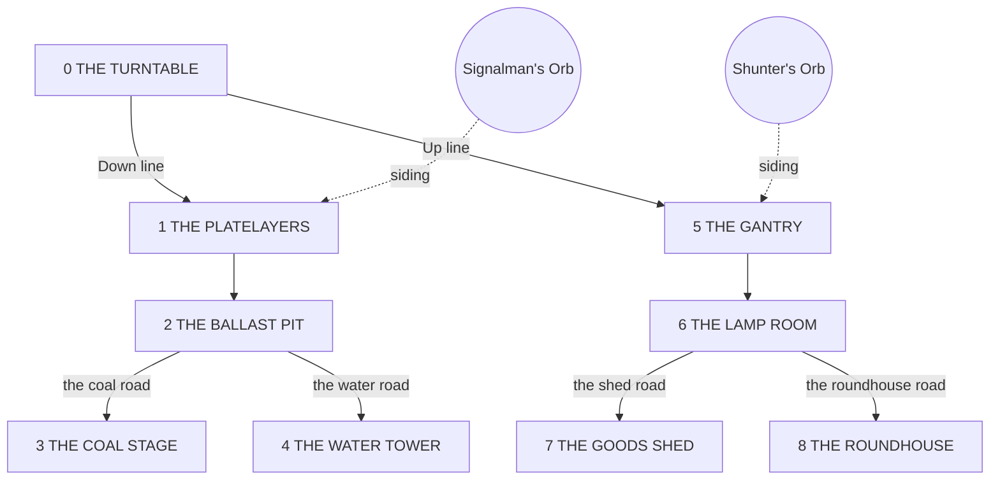

# The Switchyard - a chain of four doors, and the first dungeon with points in it
## Execution spec for Claude Code (Opus)

**Written against commit `e38d968`** on `main` ("The guide catches up with the
five fixes", 2026-08-26 18:06 -0400). Every `file.rs:line` below was read off
that tip. `CLAUDE.md` is written against `b30c80b`, two commits earlier; where
its counts and this document's disagree, this one was read later and the
printers in `CLAUDE.md` §5 are the measurements. Nothing in this document was
replayed: the container it was written in has no Rust toolchain, so every
difficulty claim below names the replay that would prove it rather than
claiming a number.

Companion to `design/the-unwinding.md` and written in its shape, because that
is the shape the repo's last mission shipped in. Read, in order: `CLAUDE.md`;
`design/HANDOFF.md`; `design/post-unwinding.md` (the audit, and the most recent
record of what the code actually does); then this. Like them: **code follows
this document; when they disagree, this is the bug report** - except where a
section below is a record of what the code does today, in which case the code
is the news and this document is quoting it.

**What this adds, in one paragraph.** A four-door chain in the rung-19-to-35
stretch, seeded by two words. Its centrepiece is THE SWITCHYARD: nine floors in
a graph with two levels of points, four fights deep on every path, where one
entry sees four floors and a run that does everything right sees eight. Its
rewards are four enchantments that exist nowhere else, two Orbs of Travel whose
destinations are the parts of the yard you did not walk, and four brand-new
combat effects that ride on those enchantments and orbs and nothing else. The
engine work is one primitive - a dungeon that is a graph rather than a list -
and four `Action` variants, landed inert and armed by content.

**Structure.** Part A is mechanics. Part B is the chain and the yard in the
base game's own voice - **this is canon; every engine string comes from Part
B.** Part C is the turtle theme's telling, `theme.rs` entries only. Part D is
the execution plan in `HANDOFF.md`'s idiom. Part E is what could not be
settled from the repository.

---

# PART A - MECHANICS

## A0. What the code does today, established before anything was designed

Every fact here has an address. The design in A1-A6 is built against these and
nothing else.

**Dungeons are linear.** `Dungeon` is `{ id, name, blurb, entry, floors:
&[&str], landings, reward, also }` (`dungeon.rs:13-45`). A floor is a creature
name; `Run::dungeon` is `Option<(&'static Dungeon, usize)>` - the dungeon and
which floor (`run.rs:666`). `Run::monster()` puts the floor's creature in front
of everything else (`run.rs:887-892`). A floor won moves `floor + 1` or, at the
last, applies `also` and hands over the class (`run.rs:2208-2245`). A floor
**lost** sets `dungeon = None` and then falls through to the mode's own cost -
a Grinder knock-back or a Rogue life (`run.rs:2318-2367`); the door does not
reopen, because the event that opened it is answered. **There is no flee**:
`grep -n flee crates/engine/src/run.rs` finds nothing. A floor pays its own
bounty, because the bounty is read off `monster()` (`run.rs:2170-2171`). A
floor does **not** drop its `drops`: the dungeon-victory arm never reads them
(`run.rs:2208-2245`), whatever `the-unwinding.md` Part B says about "the
named-drop rule". `alternate(name)` finds floors in `ALTERNATES`
(`combat.rs:6315`), which is 19 creatures, and `CREVICE` is empty
(`combat.rs:6312`).

**Dungeon presentation is specified and built.** The banner is
`Interrupt::describe` - `"{name} - floor {n} of {m}"` (`run.rs:423-425`); the
GUI prints `FLOOR n OF m` and a row of pips, one per `d.floors.len()`, filled
below the current floor and ringed at it (`gui/main.rs:9512-9578`); the CLI's
`show_road` prints the same banner over the stack (`cli/main.rs:341-348`). The
entry cutscene rides `pending_scene` (`run.rs:1669-1676`); the landing rides
`pending_landing` (`run.rs:2217-2218`). The route map draws a dungeon as
`NodeKind::Dungeon { floors }` hanging off the loop its door opened
(`route.rs:43-44, :259-266`) and the ASCII printer says `(n floors)`
(`route.rs:360-361`).

**The road stack is derived, not stored.** `Run::road_stack()` (`run.rs:931`)
builds the list from `dungeon`, `town`, `at_fountain`, `standing_events()`,
`brawl` - dungeon on top, then gate, fountain, events in table order, brawl.
`road_is_blocked` refuses a fight while anything but a dungeon is on the stack
(`run.rs:911-913`, `Interrupt::blocks_a_rematch` at `:440-442`). Off-road
events arrive through `forced_event` (`run.rs:649-655, :986-994`).

**Enchantments.** `PieceKind::Enchantment` (`piece.rs:189`) is a second layer
in `Slot` (`slot.rs:38-52`); it collides only with its own layer
(`slot.rs:233-246`); it is *live* when nothing else on that layer touches it
(`slot.rs:130-148`), *buried* when gear covers every cell (`:154-157`), and
*bonded* when one item covers every cell and the enchantment is live - the
item gains `+100` power and the enchantment's `triggers` (`loadout.rs:766-798`).
A smothered enchantment gives nothing, stats included (`loadout.rs:588-595`).
Rated at `BOND_POINTS = 45.0` plus its own stat line (`rating.rs:677, :724`).
Six exist: Keystone Base, Chalked Circle, Open Palm, Sprung Board, Quiet Room
(`piece.rs:9478-9598`) and the Lightning Rod (`piece.rs:9864-9877`). The
exclusivity rule for the kind is kept vacuous on purpose: enchantments are every
grid's (`tests/catalog_shape.rs:370-386`).

**The town-stock law** is `is_town_stock(def) = is_town_only(name) ||
def.kind.is_enchantment()` (`piece.rs:10347-10349`). It is enforced on the
**road's shelves**: the restock pool filters it out (`shop.rs:126`), so does the
weapon repair (`shop.rs:257`) and the standing-order fill (`shop.rs:301`). The
town cart is `town_shelf()` = `TOWN_ONLY` plus **every enchantment in `CATALOG`
by kind**, with no event-only filter (`piece.rs:10283-10293`), and the town's
shop door puts exactly that list out (`run.rs:3597-3600`). The Slagworks' mold
line is an explicit list, `MOLD_LINE` (`run.rs:212-213`). What the law does
*not* touch: `Outcome::Give` allocates a component into `owned` and asks nothing
about kind (`run.rs:1408-1417`); `melt` refuses event-only pieces in and out
(`run.rs:1818-1836`); `dearer_than` excludes them (`piece.rs:10311-10331`);
`stepped_component` excludes them from every footprint family
(`combat.rs:325`).

**Orbs and pedestals.** Four `Destination { id, name, via_orb, kind: Where }`
keyed by orb name (`pedestal.rs:47-75`); `Where` is `Event(id)` or
`Dungeon(id)` (`:25-30`). `feed_pedestal` refuses an unowned orb, refuses a
visited destination, consumes the orb, and either enters the dungeon at floor 0
or sets `forced_event` (`run.rs:1688-1717`). One visited-set for both pedestals
(`run.rs:645-648`). The pedestals stand at EXTRA LARGE (hidden, after index 13)
and HIGH WICK (pinned, after index 31) (`town.rs:367-374, :401-410`);
`Action::Pedestal` is the one door that does not cost the visit
(`town.rs:112-114`), so any number of orbs can be fed in one visit. The four
orbs are ordinary Orb-kind weapon cores (`piece.rs:9613-9683`), dealt by the
road shop like any Orb-kind piece - there is no "low weight" anywhere in
`shop.rs` - and guaranteed on Aisle 9 (`AISLE_NINE`, `run.rs:207-208`). The
Stray Orb is the one component combat reads by name (`STRAY_ORB`,
`piece.rs:10297`, read at `loadout.rs:872`).

**Rumours.** `Rumour { name, on_the_bar, hint, price, opens, needs }`
(`rumour.rs:103-120`); `Condition` is `Crowded`, `BankedAllRun`, `Carried`
(`:61-75`). Eight exist (`:122-225`). **The bar is full**: `SHELVES` is exactly
six names (`rumour.rs:241-248`) and `SHOP_SIZE` is six (`shop.rs:7`), and
`every_rumour_can_be_come_by` requires a word that is not on the bar to be
handed over by an event's `Give` or a town door's `gives()`
(`rumour.rs:397-415`, `town.rs:167-173`). Whispered doors stand in windows and
go first on their rung (`run.rs:1059-1073, :986-1000`).

**Events.** Every event's zero-based `at`, trigger and `expects` was extracted
from `event.rs:590-1990`. The free rung indices between Kettleworks (after 17)
and High Wick (after 31) are **18, 20, 25, 27**; between High Wick and the
Slagworks (which stands after 33, so its gate is met on arriving at 34) they
are **32** and **34**. `LadderEvent::at` is zero-based
and the displayed rung is `at + 1` (`CLAUDE.md` §6 trap 9, and every `expects`
confirms it: `the-crownwright` at 19 expects Bone Cantor, `LADDER[19]`). Bosses
stand at indices 14, 30, 46; fountains at 7 and 14 (`Run::FOUNTAINS`,
`run.rs:2734`) and the doubling fountain at `DOUBLING_FOUNTAIN = 46` (`:2742`).

**Combat ordering.** Each tick: slow-time arrivals, then damage over time and
healing, then sudden death past `SUDDEN_DEATH_MS = 30_000` (`combat.rs:40`),
then curse timers, then activations - walked player first, then each foe, and
within a fighter in item index order (`combat.rs:4070-4079`); a frost slows the
bar, a stun stops it dead and it resumes (`:4083-4111`). `activate` resolves an
item's flat effects then its triggers in written order. Damage lands through
`take_typed_with`: resist and pierce and harden, then the lane's flat answer
(shield for magic, Deflection for physical), then slow time, then armour
absorbs first and health takes the rest (`combat.rs:3304-3357`). The fight
ends when every foe is down or the player is; a shared tick goes to whoever is
less far past zero, dead heat to the player (`combat.rs:4276-4297`).
`RunningItem` carries `cooldown_ms`, `progress_ms`, `stun_ms`, `rating`,
`adjacent_items`, `aligned_items`, `diagonal_items`, `watched`, `watch_paid`
(`combat.rs:2651-2705`). `Watch` counts events the fight already emits and
never its own item (`piece.rs:782-812`); a `Watched` variant whose payload can
produce the thing it counts recurses (`CLAUDE.md` §6 trap 16).

**Rating.** `piece_rating` is `fn(&PieceDef) -> i32` and everything prices
definitions (`the-unwinding.md` #20). Actions are priced in `action_points`
(`rating.rs:366-466`) against `weight` constants (`rating.rs:28-160`):
`HASTE_PS = 9.0`, `DENIAL_S = 13.0`, `AIMED = 2.4`, `STACK_PS = 11.0`,
`ARMOR_PS = 1.5`, `HEALTH = 0.11`, `RESOURCE_PS = 4.0`, `MANA_PS = 4.0`,
`HELD_SHARE = 0.25`, `HELD_PER_POINT = 2.6`; `Grow(n)` is `n × HEALTH ×
TYPICAL_FIGHT_S` (`rating.rs:411`). `stepped_component` sorts a footprint
family by `monster_value` and steps along it (`combat.rs:292-353`), which is
why a weight change or a footprint sibling re-gears the ladder on Easy, Hard
and Insane (`the-unwinding.md` #4, #19) - and why it filters out boss-only,
quest-reward, **event-only** and Insight-touching pieces (`combat.rs:306-331`).

**The five basis vectors and the bleed cycle** are `axes()`:
Weapon (conversion, bleeds reaction), Gloves (reaction, bleeds tempo), Greaves
(tempo, bleeds reserve), Chest (reserve, bleeds economy), Helmet (economy,
bleeds conversion) (`tests/catalog_shape.rs:204-212`). The exclusivity table
that matters to this document: `StunStrongest`, `Drain`, `OnAdjacentActivate`,
`PerAdjacentItem` are Gloves-only; `OnBattleStart`, and `ReduceCooldown` and
`speed_bonus` *outside the weapon*, are Greaves-only; `Grow`, `reflect`,
`harden` are Chest-only, `GainDeflection` Chest Mostly(70); `Consume`,
`GainEmpowerment`, `GainShield`, `MindDamage`, `GainDread`, `mind_resist` are
Helmet-only, Insight income Helmet Mostly(80); the casting kinds, `power_bonus`,
`GainForking`, `OnOtherCast`, `PerAdjacentEmpty` are Weapon-only
(`tests/catalog_shape.rs:262-389`). Every budget is 0 and every quota is at 0
distance (`post-unwinding.md` §5).

**Frames.** `MonsterFrame { name, band, theme, note }` (`bestiary.rs:381-393`);
`FRAMES` is fifteen and all dressed (`bestiary.rs:400`, `CLAUDE.md` §3);
`unpacked()` and `is_unpacked()` are the lint's questions (`bestiary.rs:525-
537`). Themes fill two grids each, Wall three (`bestiary.rs:119-134`); Hollow
is Helmet and Chest, whatever `monster-themes.md` §7 says
(`post-unwinding.md` #27).

**Share codes** record a board and a rung and nothing about a dungeon
(`share.rs:1-10, :183`). Version 3. Nothing here touches them.

## A1. The branching dungeon: a floor graph, thrown points, and what a loss, a flee and a return mean

### A1.1 The data

`Dungeon.floors` stops being a list of names and becomes a list of floors that
know where they lead:

```rust
/// One room of a dungeon: a fight, what is said after it, and where it goes.
pub struct Floor {
    /// The creature. An alternate, as today.
    pub creature: &'static str,
    /// Said on the landing after this floor is cleared. For a leaf this is
    /// the ending. Moves here from `Dungeon.landings`, one per floor, so the
    /// two can never be a different length.
    pub landing: &'static str,
    /// Indices into `floors`. Empty: a leaf, and the dungeon ends here. One:
    /// the next floor, as every shipped dungeon has. Two or more: points.
    pub exits: &'static [Exit],
    /// Read when the exits are two or more: the scene at the points. Empty
    /// otherwise, and `the_points_have_a_scene` refuses a fork without one.
    pub fork: &'static [&'static str],
    /// Played when a dungeon is *entered at* this floor rather than walked to,
    /// which only a `Where::Siding` does. Empty for every floor an orb cannot
    /// land you on.
    pub entry: &'static [&'static str],
    /// Applied on clearing this floor, before the landing. For a leaf this is
    /// what clearing the dungeon by this route pays; for a floor in the middle
    /// it is nearly always empty. `Dungeon.also` and `Dungeon.reward` keep
    /// meaning "on any exit" so the six shipped dungeons need no change of
    /// meaning - a leaf's `also` is on top of them.
    pub also: &'static [crate::event::Outcome],
}

/// One way out of a floor.
pub struct Exit {
    pub to: usize,
    /// What the lever is called. Shown as a choice; through the theme layer.
    pub label: &'static str,
    /// One line under it, in the register a `Choice::blurb` has.
    pub blurb: &'static str,
}
```

`Dungeon.floors: &'static [Floor]`; `Dungeon.landings` is deleted and its
strings move into each `Floor.landing`. Floor 0 is always the entry. The six
shipped dungeons convert mechanically: floor `i` has `exits: &[Exit { to: i+1,
label: "", blurb: "" }]` and the last has none. `Retold.landings` in `theme.rs`
(`theme.rs:30-40`) keeps its shape - a list parallel to `floors` by index -
and `Theme::landings` keeps its signature, because the theme is indexed by
floor number and floor numbers do not move.

Lints, in `dungeon.rs`'s own test module beside the five that exist
(`dungeon.rs:268-349`): every `Exit.to` is in range; no exit points at floor
0 or at itself; the graph is acyclic (a depth-first walk from 0 never revisits);
every floor is reachable from 0; every floor with two or more exits has a
non-empty `fork`; every floor with fewer has an empty one; every floor with a
non-empty `entry` is the `Where::Siding` of some destination and every
`Where::Siding` lands on a floor with a non-empty `entry`. `every_dungeon_pays_
something` (`dungeon.rs:294-302`) extends to "or every leaf's `also` is
non-empty".

### A1.2 The run state

`Run::dungeon: Option<(&'static Dungeon, usize)>` keeps its type. The `usize`
is now a floor **index in the graph**, not a count of floors walked; for the six
shipped dungeons the two are the same number, which is the whole reason the
type can stay.

Two fields are added:

```rust
/// Floors of dungeons this run has cleared, by dungeon id and floor index.
///
/// Kept for the rest of the run rather than for the visit, because a floor
/// cleared is a floor cleared: coming back by another door walks past it
/// rather than fighting it again. It is also what the route map draws and
/// what a re-entry has to know.
pub cleared_floors: Vec<(&'static str, usize)>,
/// Standing at the points: the floor just cleared has more than one way on
/// and the player has not said which.
///
/// Not derived, because it is genuinely new information: `dungeon` says
/// where you are and `cleared_floors` says you have beaten it, and neither
/// says whether you have chosen. Set by `settle`, cleared by `throw_points`
/// and by `leave_dungeon`.
pub at_points: bool,
```

`Run::seeded` initialises both empty (`run.rs:723-805`); `wipe` clears both
(`run.rs:2487`).

### A1.3 The four transitions

**Clearing a floor** (`run.rs:2208-2245`, rewritten). On `Victory` inside a
dungeon: `wins += 1`; push `(d.id, floor)` onto `cleared_floors`; apply
`floors[floor].also` through `apply_outcome` and take its receipt lines; set
`pending_landing` from the theme's landing for that index. Then, by
`exits.len()`:

- **0 (a leaf):** the dungeon ends. Apply `d.also`, hand over `d.reward` if it
  is a class, `dungeon = None`. Exactly today's last-floor arm, with the leaf's
  own `also` applied first so the receipt reads leaf, then dungeon.
- **1:** `dungeon = Some((d, exits[0].to))`. Today's `floor + 1`.
- **2 or more:** `dungeon` stays on the cleared floor and `at_points = true`.

Then, in every case, **walk through cleared floors**: while `dungeon` is on a
floor already in `cleared_floors`, follow it - one exit, take it; several,
take the single uncleared one if exactly one is uncleared, otherwise stop and
set `at_points`; none, it is a cleared leaf, which cannot happen because a
destination fires once and a leaf is reached by one destination or by the
entry. Each floor walked through adds a receipt line, `"Walked through: {name}
- cleared"`, so the player who came in by a siding sees the yard they already
know go past rather than a banner that jumped.

**Throwing the points.** `Run::throw_points(&mut self, exit: usize) -> bool`:
refused unless `at_points` and `exit < floors[here].exits.len()`; sets
`dungeon = Some((d, exits[exit].to))`, `at_points = false`, pushes
`(d.id, here, exit)` onto `took_exits: Vec<(&'static str, usize, usize)>` (for
the map and the receipt), writes the receipt `"The points are thrown: {label}"`,
then runs the walk-through above (a thrown lever can land you on a cleared
line). A fight cannot start while `at_points`: `road_stack()` puts
`Interrupt::Points(d, floor)` on top and `Interrupt::blocks_a_rematch` is
true for it, so `road_is_blocked` says `"the points"` and `fight_next` is never
reached. `monster()` while `at_points` still returns the cleared floor's
creature, which is harmless because nothing can fight it; the interface reads
the fork instead.

**Leaving** - the flee the code does not have. `Run::leave_dungeon(&mut self)
-> bool`: legal only in `Phase::Loadout` with `dungeon.is_some()`, which is to
say at a landing or at the points and never mid-fight; sets `dungeon = None`,
`at_points = false`, counts nothing against `losses`, costs no life and no
knock-back, and writes `"Left {name}. What you cleared stays cleared."`
Cleared floors are kept. The door does not reopen - the event is answered and
the orb is spent - so leaving is not free: it is the line forfeited unless a
siding orb brings you back, and a siding orb is won at a leaf, so a run that
leaves before its first leaf never sees the yard again. That is stated on the
leave button's blurb and it is the design, for the same reason the casino's
door shuts at rung nine: a decision has to be able to cost something.

Why add it at all, when the six shipped dungeons live without it: a
three-floor dungeon whose last floor you cannot beat costs one life to learn.
A four-deep dungeon with points costs a life to learn *per branch*, and a
branch you cannot see before you throw the lever is a fight you did not choose
- which `dungeon.rs:322-326` says is the one kind this game must never hand
out. Leaving is how the points stay a decision rather than a trap.

**Losing** is unchanged in cost (`run.rs:2318-2367`): `dungeon = None`,
`at_points = false`, and the mode's own price. What changes is that
`cleared_floors` is **not** rolled back - the floors you beat before the one
that beat you stay beaten, which matters only if a siding brings you back, and
then it matters completely. A Grinder knock-back moves the rung down by one
and the dungeon's mouth event is answered, so the road does not re-offer it;
nothing about that is new.

**Re-entering** is a new way in: `Run::enter_dungeon_at(&mut self, id, floor)`.
`enter_dungeon` (`run.rs:1669-1676`) becomes `enter_dungeon_at(id, 0)`. The
new one sets `dungeon = Some((d, floor))`, plays `floors[floor].entry` on
`pending_scene` if non-empty and `d.entry` otherwise, then runs the
walk-through, because the whole point of a siding is that you may have been
here.

### A1.4 The stack, the banner, the pips, the strip, the map

**Stack.** `Interrupt` gains `Points(&'static Dungeon, usize)`. `road_stack()`
pushes it first when `at_points`, above `Dungeon` - you are standing at the
lever, and the lever is in the dungeon. `kind()` is `"points"`, `id()` the
dungeon's, `name()` the dungeon's name, `blocks_a_rematch()` true,
`blocking_name()` `"the points"`. `PartialEq` compares floor as `Dungeon` does
(`run.rs:456-466`).

**Banner.** `Interrupt::Dungeon(d, floor).describe()` (`run.rs:423-425`) reads
`"{name} - floor {n} of {m}"` today, where `n` is `floor + 1` and `m` is
`floors.len()`. Both numbers are wrong for a graph: a floor's index says nothing
about depth, and nine floors are not nine fights. So:

- `n` = fights won *this entry* + 1. `Run::fights_this_entry` is derived:
  floors cleared since `dungeon` was last set from `None`, which is a counter
  reset in `enter_dungeon_at` and incremented in the victory arm. Not stored
  separately from `cleared_floors`; a small `entry_started_at: usize` index
  into `cleared_floors` is enough.
- `m` = `n - 1` plus the **longest path of uncleared floors from the floor you
  are standing on**, counting it. `Dungeon::fights_ahead(floor, cleared) ->
  usize` is a pure function over the graph, and for a linear dungeon at floor
  0 with nothing cleared it is `floors.len()`, so the six shipped banners do
  not change by a character. `tests/dungeons.rs` gets one assertion saying so.
- Between the two, the floor's own name. So a run entering THE SWITCHYARD reads
  `THE SWITCHYARD - THE TURNTABLE - floor 1 of 4`, and one that came back by
  the Up line and walked past two cleared floors reads `THE SWITCHYARD - THE
  ROUNDHOUSE - floor 1 of 1`. The shipped dungeons keep reading `THE THRESHOLD
  - DOORKEEP - floor 1 of 3`, which is one word more than today and the word is
  the creature's name, which the opponent panel already prints beneath it.

At the points, `Interrupt::Points(d, floor).describe()` reads `"{name} - the
points after {floor name}: {label} / {label}"`, labels joined by ` / ` in exit
order. The GUI's banner line (`gui/main.rs:9559-9566`) and the CLI's
(`cli/main.rs:341-348`) both read `describe()` instead of formatting their own,
which is the change this needs anyway.

**Pips** (`gui/main.rs:9567-9578`). Filled pips for fights won this entry; the
ringed pip for where you stand; hollow pips for `fights_ahead - 1`. A fork is
not drawn ahead of time - a player at floor 1 of 4 does not know the yard has
points - but a pip that *was* a fork is drawn as a filled pip with a short
tick under it once thrown. Total pips equal `m`, so the row never changes
length mid-entry except when leaving cleared floors behind, which is the one
time it should.

**Strip** (A7 of the Unwinding, `gui` stack strip). At the points the strip's
head is `points` with a hover that lists the exits: each exit names its floor
and says `cleared` or nothing, which is exactly `Requirement::describe`'s job
done for a lever. Inside a branch the strip reads as today: `THE SWITCHYARD
(floor 2 of 4) -> whatever was under it -> the fight`, with the fights-ahead
figure from the banner.

**Map** (`route.rs`). `NodeKind::Dungeon { floors }` becomes `Dungeon { fights:
usize, forks: usize }` - fights on the longest path from floor 0, and the
number of floors with two or more exits. The ASCII printer says `(4 fights, 2
points)` for the yard and `(3 fights)` for THE THRESHOLD, dropping the word
`points` when the count is zero so the shipped line does not change. Pip rows
along the branch draw the path taken from `took_exits` and stop at the leaf;
branches not taken are not drawn. Rule 2 of A10 (`route.rs:19`) is unchanged
in spirit: the loop is the road stack, and a graph dungeon is still a loop
that comes home.

**Receipts.** Every transition above writes `last_receipt`. The leaf's `also`
lines come first, then the dungeon's. The A9 machinery is untouched.

**CLI.** Two verbs: `throw <n>` (the points; refused with `"not at the points"`
otherwise) and `leave` (refused unless inside a dungeon at a landing or at the
points). `show_road` prints the exits under the banner when `at_points`, in
the form the event printer uses for choices (`cli/main.rs:359-372`), numbered
from 0. A scripted run that uses both replays identically or `acceptance::e6_1`
is red.

### A1.5 Determinism and what it costs

Nothing here consults the PRNG. `throw_points` is player input, recorded in
`took_exits`, so a replay of the script makes the same walk. The walk-through
is a pure function of `cleared_floors` and the graph. A CLI transcript of a
full yard - entry, four fights, High Wick, two orbs, five more fights - diffed
against itself twice is acceptance criterion 1 in Part D.

### A1.6 Why the primitive is this shape and not another

- **Points on the floor, not a separate `Fork` table.** A fork is a floor that
  has more than one exit. Making it a floor keeps `Run::dungeon`'s type,
  keeps the theme's landing index, keeps `route.rs` walking one list, and
  keeps six shipped dungeons as a mechanical rewrite of their tables.
- **Cleared floors on the run, not on the visit.** The whole reward of an orb
  is that it takes you somewhere you have not been; if a re-entry re-fought
  the yard the orb would be a worse version of the door you already used.
- **Leaving keeps cleared floors and costs the line.** Leaving that reset
  progress would be a loss with a different name. Leaving that could be undone
  by walking back in would make the points free to sample, and a free sample
  is not a decision.
- **No flee mid-fight.** Fights are pure functions of two boards
  (`combat.rs:3862`); a fight you can stop is a fight whose outcome depends on
  when you stopped it, and the oracle would stop being one.

### A1.7 What M1 actually touches, counted rather than guessed

`Dungeon.floors` going from `&[&str]` to `&[Floor]`, and `Dungeon.landings`
disappearing into them, is a small change with a wide edge. Every reader at
the tip, listed so none of them is discovered at midnight:

| Site | Today | After |
|---|---|---|
| `run.rs:889` | `d.floors.get(floor).and_then(alternate)` | `.map(f.creature).and_then(alternate)` |
| `run.rs:424` | `d.floors.len()` in the banner | `fights_ahead` (A1.4) |
| `run.rs:2217` | `theme.landings(d.id, d.landings).get(floor)` | `theme.landing(d.id, floor, d.floors[floor].landing)` |
| `run.rs:2219` | `floor + 1 < d.floors.len()` | the exits arm (A1.3) |
| `route.rs:265` | `NodeKind::Dungeon { floors: d.floors.len() }` | `{ fights, forks }` |
| `theme.rs:148-156` | `Theme::landings(id, canonical: &[&str]) -> &[&str]` | `Theme::landing(id, floor, canonical: &str) -> &str`, same fallback, same `Retold.landings` table |
| `gui/main.rs:9516, :9561, :9569` | `d.floors.len()`, three times | `describe()` and `fights_ahead` |
| `cli/main.rs:347` | `d.floors.len()` | `fights_ahead` |
| `tests/dungeons.rs:33, :47-48, :52, :65, :85, :102-104` | walks `d.floors` as names; asserts `landings.len() == floors.len()` | `f.creature`; the length assertion is retired because the type now guarantees it, and the graph lints replace it |
| `tests/chain.rs:221, :290-291` | `for _ in 0..d.floors.len()` | `0..fights_ahead(0, &[])` - both walk THE THRESHOLD, which is linear, so the count is unchanged |
| `tests/progression.rs:1617, :1620, :1865, :1869` | `d.floors.contains(&m.name)`, `.last()`, `[0]` | `.iter().any(f.creature == name)`, `.last().map(f.creature)`, `floors[0].creature` |
| `tests/packing.rs:1815` | `d.floors.iter().position(*f == name)` | `f.creature == name` |
| `tests/prose.rs:59, :266, :435` | iterates `d.landings` | `d.floors.iter().map(f.landing)`, **plus `f.fork` and `f.entry` added to the scene lists** |
| `tests/two_voices.rs:68, :222, :243` | `chain(d.landings)`; `PLAIN.landings(..) == d.landings` | the same per floor; the `Retold` emptiness check is unchanged |

`Retold.landings` keeps its shape and its meaning - a list parallel to the
floors, indexed by floor number - because floor numbers do not move. That is
why the graph is a flat list with edges rather than anything nested: an index
is a stable key, and this repository has twice learned what happens when a key
is not (`the-unwinding.md` #23 on ids, `CLAUDE.md` §6 trap 2 on `CATALOG`).

**The two new prose fields join the lints in the same milestone**, not later.
`Floor.fork` and `Floor.entry` are player-facing paragraphs, and a scene the
lints do not walk is a scene that drifts - which is exactly how fourteen
turtle nouns sat in the canonical column for eleven milestones
(`the-unwinding.md` #23).

## A2. Four new effects

Every one below is deterministic and integer-only, is one `Action` variant
with exact semantics, has a slot home in the basis and a row in the
exclusivity table, a tooltip template in `Action::describe`, a weight in
`rating::weight`, and a test. None of them exists in the engine today: what is
new is a *transfer of time between items* (A2.1), *armour spent as growth*
(A2.2), *reading the other side's cooldown bar* (A2.3) and *income
proportional to what is held* (A2.4). Every existing income is flat, every
existing haste is an item's own, growth is a flat grant, and nothing reads a
foe's bar.

Two were considered and refused. **Couple** - "this item's aligned item
fires now too" - is a forced activation, and a forced activation fires
triggers, which can couple, and the guard for that is the same question trap
16 asks of every `Watched`; it also puts a second activation into the log
under one item's turn, which `tally_items` attributes by the last `Activate`
(`CLAUDE.md` §3). Not worth a milestone. **AtSecond** - a trigger that fires
when the clock reaches `s` - is deterministic and cheap and belongs to the
greaves like `OnBattleStart`; it is refused only because it is the fifth and
the four below already give every grid but the weapon a new verb, and the
weapon's new verbs are the orbs.

### A2.1 `Action::Shunt { ms: u32 }` - move time from this item to a slower one

*When it fires:* as any action, from whichever trigger carries it.

*What it reads:* this item's `adjacent_items` (`combat.rs:2685`) on the same
board - edge neighbours across the five grids the way `OnAdjacentActivate`
already means it.

*What it does:* choose the adjacent assembled item with the **longest**
`cooldown_ms`, ties broken by the lowest item index. Add `ms` to that item's
`progress_ms`, capped at `cooldown_ms - TICK_MS` so it can fire no earlier
than its own next turn (the walk is index-ordered, `combat.rs:4079`, and a cap
below the bar keeps the result independent of whether the target's index is
above or below the source's). Add `ms` to this item's `owed_ms`, a new
`RunningItem` field: the next `owed_ms` of bar-fill is paid down before
`progress_ms` advances (`combat.rs:4103-4108`, the `step` is applied to
`owed_ms` first while it is positive). Time is conserved: the same `ms` leaves
one bar and enters another. No adjacent item: nothing happens, and the log
says so.

*Log:* `Event::Shunted { side, from: usize, to: usize, ms }`. `who` as every
entry has.

*Same-tick ordering:* the target's `progress_ms` is read on its own turn, so
a target below the source in index order sees the gift this tick and a target
above sees it next tick; the cap makes both fire on the same later tick. The
source's `owed_ms` is read on its next turn.

*Interactions:* frost slows the `step` (`combat.rs:4103`), so a frosted item
pays its debt slower - correct, it is slower. A stunned source does not pay
its debt while stunned (`:4095-4098`), because a stunned bar does not move. The
target may be stunned; the progress it was handed sits under the stun, which is
what a stopped bar means. `Longhaul`'s haste scales the step and therefore the
repayment. `Untimely` and `misfire` see an activation on the target as they see
any other; a misfire on the target's forced-earlier activation is a misfire.

*Slot home:* **Greaves, tempo**, and Greaves-only **outside the weapon**,
exactly the row `ReduceCooldown outside the weapon` has
(`tests/catalog_shape.rs:359-370`): a new `Rule { what: "Shunt outside the
weapon", home: Greaves, level: Only, budget: 0, target: 0 }`. Inside the
weapon it is the orb's: Shunter's Orb carries it.

*Tooltip:* `"hand {ms/1000:.1}s of this item's next cooldown to its slowest
neighbour"`.

*Weight:* `weight::SHUNT_PS = 3.0` points per second moved. Time is conserved,
so the naive price is zero; what is bought is *where* the time is spent, and a
second on a 5,000 ms chest item is worth more than a second on a 1,500 ms
weapon by roughly the ratio of what those items carry. Three is a third of
`HASTE_PS`, which is the discount for the fact that the rating cannot see which
neighbour it will find. `action_points`: `Action::Shunt { ms } => ms as f32 /
1000.0 * weight::SHUNT_PS`. `scaled()`: `ms` scales, like `ReduceCooldown`.

*Test:* `tests/effects.rs::shunt_moves_time_and_conserves_it` - a weapon with
`OnActivate(Shunt { ms: 400 })` beside a chest item; over a fixed window the
chest's activations rise by the shunted time over its cooldown, the weapon's
fall by the same over its own, and the sum of both bars' movement equals the
unshunted sum. And `shunt_with_no_neighbour_does_nothing`.

### A2.2 `Action::Ballast(n: i32)` - spend armour to grow

*What it reads:* the owner's `armor`.

*What it does:* `let paid = n.min(self.armor.max(0))`; `armor -= paid`;
`max_health += paid`; `health += paid`. Nothing below one point of armour.
That is `Grow(paid)` (`combat.rs`, `Action::Grow`, and `Event::Grew`) funded
from armour rather than granted, and it is logged as `Event::Grew { side,
amount: paid, .. }` with `paid_armor: paid` - so `settle`'s growth banking
(`run.rs:2085-2098`) sees it without a new arm and `grown_health` compounds
across the run exactly as Grow does. A new `Event::Grew` field rather than a
new event, so every reader of `Grew` keeps working and the one that wants to
know reads the field.

*Same-tick ordering:* reads armour as it stands when the action resolves,
after any hit earlier in this tick's walk absorbed into it. Deterministic.

*Interactions:* Bastion regrows armour from what it absorbs
(`combat.rs:3349-3352`); Ballast then spends it. Reflect pays back a share of
what armour ate (`rating.rs:56-65`); Ballast leaves less armour to eat with,
which is the trade. Unionized's opening armour (`combat.rs:3888-3890`) is
Ballast's opening fuel. Sudden death takes health past armour
(`combat.rs:24-40`), so past thirty seconds every point of armour is dead
weight and every point of Ballast is the only thing the clock respects - which
is the reason to want it, and the reason a Wall-shaped creature carrying it is
a different creature.

*Slot home:* **Chest, reserve**, Chest-only, in the row `Grow` already has
(`tests/catalog_shape.rs:319-322`): extend that rule's `carries` to `Grow(_)
| Ballast(_)`. The reserve axis's `does` gains `Ballast(_)` beside `Grow(_)`
(`tests/catalog_shape.rs:157-168`).

*Tooltip:* `"turn up to {n} armour into {n} maximum health, for the rest of
the fight"`.

*Weight:* priced as Grow with the condition discounted:
`Action::Ballast(n) => n as f32 * weight::HEALTH * TYPICAL_FIGHT_S *
weight::BALLAST_FUNDED`, `BALLAST_FUNDED = 0.66` - the same two-thirds every
conditional in `rating.rs` takes for "what a build that wanted it will
manage". `scaled()`: `n` scales, like `Grow`.

*Test:* `tests/effects.rs::ballast_spends_exactly_the_armour_it_has` - a
combatant with 20 armour and `Ballast(30)`: after one activation armour is 0,
max health up 20, health up 20; a second activation does nothing. And
`ballast_banks_as_growth` - `Run::settle` after a fight with Ballast raises
`grown_health` by the paid total.

### A2.3 `Action::Derail { window_ms: u32, back_ms: u32 }` - catch a thing at the top of its swing

*What it reads:* the **front foe's** items (`aim_of(foes, p.aim)`,
`combat.rs:5126`, the same aim `Damage` uses in a party), each item's
`cooldown_ms`, `progress_ms` and `rating`.

*What it does:* among the foe's items with `cooldown_ms - progress_ms <=
window_ms` - the ones within the window of firing - pick the highest `rating`,
ties to the lowest index; `progress_ms = progress_ms.saturating_sub(back_ms)`.
None in the window: nothing, logged. Only ever `Target::Enemy`; a `Yourself`
Derail is refused by `assembly::every_action_is_well_formed` because there is
no reading of it that is not a stun on your own bar.

*Log:* `Event::Derailed { side, who, item: usize, by_ms }`.

*Same-tick ordering:* the player's items resolve before every foe's each tick
(`combat.rs:4070-4079`), so a player-side Derail reads the foe's bars *before*
the foe's turn this tick - an item inside the window is set back before it can
fire. A foe-side Derail reads the player's bars after the player's turn, so it
sees this tick's post-fire state. Both are fixed by the walk order and replay
identically; the asymmetry is the walk's, not this action's, and it is written
here so nobody re-derives it.

*Interactions:* a stunned item's bar does not move, so a Derail on it
subtracts progress it will resume from - a stun and a Derail stack by
addition of the two delays, which is fine because both are on one item and
the stun cap (`STUN_CAP_MS`, `curse.rs:55`) is about stun. Frost is a slow on
the step; Derail is a subtraction on the bar; independent. It is not a curse,
so `curse_resist` does not answer it and `Watched::CurseApplied` does not
count it; that is deliberate, because it is the answer to a creature whose
whole board is curse resist.

*Slot home:* **Gloves, reaction** - a hand on the wire. Gloves Mostly(70),
the remainder in the weapon, which is Gloves' upstream in the bleed cycle:
Weapon bleeds reaction (`tests/catalog_shape.rs:207`). A new `Rule { what:
"Derail", home: Gloves, level: Mostly(70), budget: 0, target: 0 }`; the
reaction axis's `does` gains `Derail { .. }` beside `StunStrongest`
(`:170-186`). Signalman's Orb carries the weapon's one.

*Tooltip:* `"if the enemy's best item is within {window/1000:.1}s of firing,
set it back {back/1000:.1}s"`.

*Weight:* `Action::Derail { window_ms, back_ms } => back_ms as f32 / 1000.0
* weight::DENIAL_S * weight::AIMED * weight::DERAIL_WINDOW`, where
`DERAIL_WINDOW = 0.4` is the share of a typical cooldown a 1,000 ms window
covers on a 2,500 ms board (`analysis/second-order.md` cadence figures are
the source for the typical cooldown; the number is a starting point and Part
D M4 measures it). Aimed, because it picks the best; discounted, because it
finds nothing most of the time. Not scaled by `scaled()`: a window and a
setback are not quantities of anything a multiplier multiplies, the same
reading stacks and curses get (`piece.rs:690-693`).

*Test:* `tests/reactions.rs::derail_catches_an_item_inside_the_window` - a
foe whose one item has 200 ms to go; the player's Derail fires; the foe's
item fires 600 ms later than it would have, to the tick. And
`derail_ignores_an_item_outside_the_window`. And a party test in
`tests/brawl.rs` that it reads the front foe.

### A2.4 `Action::Accrue { what: Resource, pct: i32 }` - income that reads the balance

*What it reads:* the owner's held `what`.

*What it does:* `gain = held.max(0) * pct / 100` (integer division, so
nothing accrues below `100 / pct` held); bank `gain` of `what`. Logged as
`Event::GainResource` (or `GainMana` for mana, because `settle` counts mana
through its own event, `run.rs:2110-2116`) with a new `accrued: true` field so
the log can say why. `what` may be Mana, Rage, Faith or Nature. **Never a
fusion**: a fusion pool is deliberately fuel for nothing (`piece.rs:443-450`)
and a proportional income on it would be a second currency with better rates;
`assembly::every_action_is_well_formed` refuses `Accrue` on a fused
`Resource`. **Never Insight** in this mission's content: `touches_insight`
(`piece.rs:10334-10345`) gains `Accrue { what: Insight, .. }` so the shelf
gate holds if anybody ever does, and no piece here does.

*Same-tick ordering:* reads the pool as it stands when the action resolves;
income earlier in the same activation's trigger list is counted, income from
items later in the walk is not. Deterministic and stated.

*Interactions:* `Drain` empties the balance Accrue reads, which is the
counterplay doctrine every pool has. Tired's opening debt (`combat.rs:3907`)
is a negative balance and accrues nothing. Overflowing, Consume and Fuse spend
the balance; Accrue reads what is left. Nothing recurses: Accrue emits a gain,
and no `Watched` counts gains.

*Slot home:* **Helmet, economy**, Helmet Mostly(70), remainder in the chest,
which is the one grid that may bleed economy (`tests/catalog_shape.rs:210`).
A new `Rule { what: "Accrue", home: Helmet, level: Mostly(70), budget: 0,
target: 0 }`; the economy axis's `does` gains `Accrue { .. }` (`:138-155`).

*Tooltip:* `"gain {pct}% of the {what} you are holding"`.

*Weight:* `Action::Accrue { what, pct } => weight::ACCRUE_ASSUMED as f32 *
pct as f32 / 100.0 * pool_weight(*what)`, with `ACCRUE_ASSUMED = 30`. The
same shape `Drain` is priced in - an assumed balance the rating cannot see
(`rating.rs:440-442`, `DRAINED_ASSUMED = 8` at `:363`) - but not the same
number: `DRAINED_ASSUMED` is "a deep-but-not-absurd pool" as a *victim* holds
one, and the balance a build that wanted this holds is its own opening mana,
which `towns.md`'s table puts at 46 on the winning board and 6 on the
auto-built one. Thirty is between them, discounted toward the build that
wanted it. M8 measures it. `scaled()`: `pct` scales.

*Test:* `tests/effects.rs::accrue_pays_a_share_of_what_is_held` - 40 mana
held, `Accrue { Mana, 10 }` pays 4; 9 held pays 0; a drained pool pays 0.
`tests/insight.rs::accrue_on_insight_is_gated_like_income`.

### A2.5 The table

| Effect | Variant | Home | Rule | Weight | Carried by (Part B) |
|---|---|---|---|---|---|
| Shunt | `Action::Shunt { ms }` | Greaves, tempo | Only, outside the weapon | `SHUNT_PS = 3.0` /s | Points Rodding (greaves enchantment), Shunter's Orb (weapon) |
| Ballast | `Action::Ballast(n)` | Chest, reserve | Only (in the `Grow` row) | Grow x `BALLAST_FUNDED = 0.66` | Ballast Bed (chest enchantment) |
| Derail | `Action::Derail { window_ms, back_ms }` | Gloves, reaction | Mostly(70), rest weapon | `DENIAL_S x AIMED x DERAIL_WINDOW = 0.4` | Signal Wire (gloves enchantment), Signalman's Orb (weapon) |
| Accrue | `Action::Accrue { what, pct }` | Helmet, economy | Mostly(70), rest chest | `ACCRUE_ASSUMED = 30 x pct/100 x pool_weight` | Booking Hall (helmet enchantment) |

Every carrier is `EVENT_ONLY`. Consequence, and it is the reason the catalogue
can land the way A6 says: **no creature can ever wear one.** `stepped_component`
filters event-only pieces out of every footprint family (`combat.rs:325`), so
the four weights price six components and re-gear nobody. A weight added for a
verb no existing piece speaks moves no existing rating. Part D M4's gate is
that the four-board table is byte-identical after the weights land, which is
the measurement of that sentence.

Every `Action` arm in the engine is exhaustive-matched in at least these
places and each gets its arm: `Action::describe` (`piece.rs:622-672`),
`Action::scaled` (`:674-695`), `action_points` (`rating.rs:366`), the naming
words (`naming.rs`), the GUI's action glossary, `class.rs::is_curse`-style
walkers (`class.rs:340`), and `apply` (`combat.rs:5117`). `walk_actions`
(`piece.rs:10250-10271`) walks triggers not actions and needs nothing.

## A3. Enchantments from a dungeon: routing around the law, on purpose

The law reads "ground is bought where somebody has a floor to sell, never off
the road" (`the-unwinding.md` #1; `piece.rs:10276-10293`). Read against the
code it is two separate facts, and only one of them is a law:

1. **An enchantment never reaches a road shelf.** Enforced three times in
   `shop.rs` (`:126, :257, :301`) by kind. This is the law, and its purpose is
   legible shelves: a piece of ground between a helmet and a ring is a shelf
   failing to say what a thing is.
2. **Every enchantment reaches every town cart.** A consequence of
   `town_shelf()` collecting by kind (`piece.rs:10283-10293`), written so that
   "every underlay written after this one is town gear without anybody having
   to remember".

The four enchantments of the yard are handed over by `Outcome::Give` from a
leaf's `also`. `Give` does not consult `is_town_stock` (`run.rs:1408-1417`),
so as written the code already allows it and fact 1 is untouched: the four are
never on a road shelf, because they are enchantments, and never on a road
shelf a second way, because they are event-only. **The decision is to route
around fact 2, and it is a decision because fact 2 is the one that would
otherwise break**: without a change, the four would appear on every town cart
in the game the day they were appended. So:

- The four are added to `EVENT_ONLY` (`piece.rs:10176-10214`).
- `town_shelf()` gains `.filter(|d| !is_event_only(d.name))` on the
  enchantment half. `MOLD_LINE` is an explicit list and needs nothing.
- `is_town_stock` is **unchanged**. It is still true of them, and every place
  that reads it (the three in `shop.rs`) still keeps them off the road.
- `melt` already refuses event-only in and out (`run.rs:1818-1836`) and
  `dearer_than` already excludes them (`piece.rs:10311-10331`), so the
  crucible cannot melt one and consignment cannot return as one.
- `stepped_component` already excludes them (`combat.rs:325`), so no creature
  wears one.

What this says about the law, in words the doc-comment should carry: *ground
is bought in a town, or dug up. It is never for sale on the road.* The
enchantment is still a thing you have to find a floor for; it still lies under
the grid; the two-layer mechanic (`slot.rs:120-148`, `loadout.rs:766-798`) is
untouched. What the yard hands over is unique in exactly the sense the
Lightning Rod is unique - one place, one way - with the difference that the
Lightning Rod's one place is a shelf you pay at and these are a floor you
fought for.

The alternative - stocking them on the Slagworks mold line after the yard is
cleared, so that the law's letter holds - was refused for two reasons. The
Slagworks stands after rung 33 and is hidden behind the other chain; a reward
for a rung-27 dungeon that arrives at rung 34 for a run that also did the
Unwinding is a reward most runs never see. And a shelf is a purchase, and the
leaf is already the price.

**Uniqueness, stated so it can be tested.** Each of the four is given by
exactly one floor's `also`, appears on no shelf (`tests/avail.rs` walks 400
seeded runs' shelves and asserts by name), cannot be melted into or out of, and
cannot be stepped into. `tests/enchantment.rs` gains `the_yard_s_ground_is_dug_
up_and_never_sold`: for each of the four, exactly one `Floor.also` gives it,
`town_shelf()` does not contain it, `melt` returns `None` on it, and
`stepped_component(name, ±2)` returns the name itself.

## A4. Orbs of Travel: a destination that is a floor

`Where` gains a variant:

```rust
pub enum Where {
    Event(&'static str),
    Dungeon(&'static str),
    /// A floor of a dungeon, entered directly. Cleared floors from there are
    /// walked through; the first uncleared one is fought. The orb is the
    /// only way back into a dungeon whose door is answered.
    Siding { dungeon: &'static str, floor: usize },
}
```

`feed_pedestal` (`run.rs:1688-1717`) gains the arm `Where::Siding { dungeon,
floor } => self.enter_dungeon_at(dungeon, floor)`. `pedestal.rs`'s own test
(`:95-118`) gains the arm: the dungeon exists and `floor` is in range and has a
non-empty `entry`. The visited-set, the refusal of duplicates, the consumption
of the orb, the dormant pedestal for an orbless run - all unchanged
(`pedestal.rs:9-18`).

Two new orbs, both **event-only** (unlike the four shipped, which are shop
finds; `piece.rs:9607-9612`). They are pieces first: Orb-kind weapon cores
with an effect on the spells slotted into them, worth building around by a run
that never finds High Wick's pedestal. Their footprints are chosen to match
no existing Orb's cells, so they open no new footprint family
(`combat.rs:298-300`) - and they are event-only besides, so
`stepped_component` would skip them regardless. Both are listed in Part B with
their numbers.

**Why the destinations are the yard itself.** An orb is a ticket to somewhere
(`pedestal.rs:44-46`), and the somewhere a run wants most, having walked one
line of a yard with two, is the other line. It also makes "a single run cannot
see all of it" a property of the graph rather than a promise: there are two
orbs, each line's leaves both pay the *same* orb, and that orb's destination is
the *other* line's first floor. A run that walks the Down line and feeds
Shunter's Orb enters the Up line, walks it to a leaf, and is paid Signalman's
Orb, whose destination is the Down line's first floor - where two floors are
cleared and walked through and the fork has exactly one open exit, which is
taken. Eight floors. The ninth is the other Up-line leaf, and the only orb that
goes there is Shunter's, which has been spent. A second Shunter's Orb, won at
the second Down-line leaf, is a duplicate, and a duplicate is a weapon
(`pedestal.rs:11-12`). So: one entry sees four floors; one orb sees seven; two
orbs see eight; nothing sees nine. `tests/switchyard.rs::nine_floors_and_the_
most_a_run_can_see_is_eight` walks that with `force_win` and counts.

**Where the orbs get spent.** High Wick's pedestal stands after index 31
(`town.rs:374`), and the yard is entered at 25-27, so a run holding an orb
meets a pedestal four to six rungs later, on the pinned road, without a hidden
town in between. EXTRA LARGE's pedestal (after 13) is before the yard and
irrelevant to it. That is the reason the chain stands where it stands: an orb
won after High Wick is a weapon and a story, and the yard's whole reward is
that its orbs are tickets.

## A5. Run state the chain carries

Following `the-unwinding.md` #21.1 - the state is what is visible - the chain
adds:

| Field / key | Kind | Set by | Read by |
|---|---|---|---|
| `A Word About the Sidings` | rumour in the tray | THE TIMETABLE, two doors | THE SIGNAL BOX (`Whispered`) |
| `A Word About the Points` | rumour in the tray | THE SIGNAL BOX, one door | THE TURNTABLE (`Whispered`) |
| `switchyard-cleared` | flag | every leaf's `also` | THE LAST TRAIN (`WhenFlagged`) |
| `sidings-cleared` | counter | every leaf's `also`, `Count` | THE LAST TRAIN's first door (`Counter { at_least: 2 }`) |
| `cleared_floors` | `Vec<(&str, usize)>` on `Run` | the victory arm | the walk-through, the banner, the map |
| `at_points` | `bool` on `Run` | the victory arm | the stack, `throw_points`, the interface |
| `took_exits` | `Vec<(&str, usize, usize)>` on `Run` | `throw_points` | the map, the receipt |

No new flag is waited on by anything that does not set it;
`no_flag_is_waited_on_forever` and `every_counter_is_read_by_something`
(`tests/completable.rs:361`) are the lints, and `COUNTERS_NOBODY_READS`
stays at 3 (`:283`).

## A6. The catalogue lands once

Six components: four enchantments, two orbs. Appended in one milestone (Part D
M5), in one block at the end of `CATALOG` under a comment naming this document,
because `share.rs` indexes `CATALOG` by position (`share.rs:218` per
`CLAUDE.md` §3) and the list is append-only for ever. All six are event-only,
so `stepped_component` skips them (`combat.rs:325`) and **no creature re-gears
on any setting**: the four-board table at Medium and the Easy/Hard/Insane
steps of every creature are byte-identical before and after M5, and
`acceptance::e6_2` plus a new `catalog_shape::the_yard_moved_no_creature`
(compares `gear_at` for every creature at every difficulty against a fixture
taken before M5) are the gates. `catalog_shape`'s quotas move by six pieces
in 510; `report_shape` is run before and after and every budget stays at 0 or
is lowered in the commit that earns it, never raised.

---

# PART B - THE SWITCHYARD (base game; this text is canon)

Every string in this part was run against `tests/prose.rs` and
`tests/two_voices.rs` as they stand - by reimplementing their predicates over
these strings, rather than by reading the lints and hoping. What was checked:
plain hyphens and straight quotes only (`prose.rs:82-94`), no phrase from the
withheld-noun list (`:97-180`), a name in the middle of a sentence in every
scene (`:240-254`, checked per scene and not per paragraph), somebody acting in
every scene (`:315-332`), titles that are things and not moods (`:334-361`), no
two events closing on the same sentence and not more than half closing on a
fragment under forty characters (`:283-313`), an `unmet` line over twenty
characters on every gated choice (`:363-384`), entry lines over twenty
characters and no more than three of them (`dungeon.rs:328-336`), a hint over
forty characters that does not print its own condition's numbers
(`rumour.rs:368-389`), and no word from `two_voices::BOOK`
(`two_voices.rs:35-42`) anywhere in the canonical column. Also checked: no id,
no title and no closing sentence collides with any of the thirty-three shipped
events, and the four new endings are all over forty characters, so the
fragment budget gets easier rather than tighter (1 curt of 37, needing 2 <= 37).

**It found three failures and they were all the same one.** It is the blind
spot `CLAUDE.md` §6 names at the end of its trap list: `names_something` cannot
tell a name from an article at the start of a sentence, so a scene whose people
are only ever introduced at a full stop reads as anonymous. THE TIMETABLE, THE
LAST TRAIN and the dungeon's blurb each named Hesketh or Ambrose three or four
times and failed anyway. The repair in all three is one clause - "and Hesketh
has checked", "and Ambrose writes the answer", "The timetable Hesketh sells" -
putting the name past the first word of its sentence and never immediately
after a comma, which the predicate also treats as a fresh start. **Opus must
not tidy those clauses back into two sentences.** They are shaped the way they
are shaped on purpose, and the lint will say so about ninety seconds after
anybody improves them.

Opus copies these strings; it does not rewrite them, and where a lint refuses
one it fixes the string in this document first, so that the document and the
engine never hold two versions of a scene.

## The story, in the game's own voice

Under the road, a little before the halfway mark, there is a yard where the
line was sorted. Rolling stock came in on one road and went out on another,
and what decided which was a set of points and a man in a box with a lever.
The line closed. The man did not. Ambrose has been in the box since the last
timetable was printed, and he still throws the points for trains that stopped
running, on time, because a timetable is a timetable. Hesketh sells the
timetables at the roadside, and she is the only person on the road who knows
that the yard is still working, because she is the only person who has looked
at the times and noticed that they are still being kept. Go down to the yard
and the turntable is turning. Ask Ambrose for the points and he throws them,
one way, and the other way is a line you will not walk today. Everything in
the yard is where it was left, and what was left there was left on purpose, at
the buffer stops, by people who did not expect to be back.

## New rumours (two, neither on the bar)

The bar draws exactly `SHOP_SIZE` shelves and has six things on it
(`rumour.rs:241-248`, `shop.rs:7`), so neither word is sold there - the first
is bought from a woman at the roadside and the second is told to you in a
signal box, which is the shape the other chain's second and third words already
have (`rumour.rs:146-151`). Both are `Condition::Carried`, for the reason
`rumour.rs:70-74` gives: a word somebody told you is a key, and a key with a
second lock on it is a key with a second lock on it for no reason.

| Component | `on_the_bar` | `price` | `opens` | `needs` | Hint (the hover; vague on purpose, over 40 characters) |
|---|---|---|---|---|---|
| **A Word About the Sidings** | false | `Barter::Kind(PieceKind::Mold)` | `the-signal-box` | `Carried` | "There is a yard under the road where the line used to be sorted, and Hesketh says the times are still being kept, which they would not be if nobody was keeping them." |
| **A Word About the Points** | false | `Barter::Rumour("A Word About the Sidings")` | `the-turntable` | `Carried` | "Ambrose will throw the points for you the way he throws them for the trains, which is on time and one way only, and he has never once been asked which way." |

Both are `EVENT_ONLY` (`piece.rs:10176`) and both are `PieceKind::Quest`,
one cell, `Stats::ZERO`, appended in the M5 block. `every_rumour_can_be_come_
by` passes because THE TIMETABLE gives the first and THE SIGNAL BOX the second.

## The four doors

Indices are zero-based `at`; the displayed rung is one more. Every gold
figure is a multiple of the standing rung's bounty (`the-unwinding.md` #16):
small 1x, medium 3x, large 10x. `expects` is `LADDER[at]` and
`every_event_stands_where_it_thinks_it_does` is the guard.

### 1. THE TIMETABLE - index 18 (rung 19, Ruin Hound), `Trigger::Rung`

Kettleworks stands after index 17, so its gate is on this rung too; the stack
pops the gate first (`run.rs:931-963`), which is the shape Sump Bottom and the
first fountain already share at index 7. The on-ramp is unconditional for the
reason F1 of the Unwinding is: a chain most runs never see the start of is a
chain nobody walks.

*Prose:*

1. "Hesketh sells timetables off a folding table at the side of the road, for a line that closed before the road was cut, and she sells them at the printed price because she has never seen a reason to change it."
2. "The times in them are being kept, and Hesketh has checked. Every train on the sheet leaves the yard when the sheet says, and the yard is under your feet, and you have not heard a train because there are no trains, and the times are being kept anyway."
3. "She will sell you one. She would also, if you had something small she could use, take that instead, because the money is not the point and never has been."

*Choices:*

| Label | Blurb | `requires` | `outcome` | `unmet` |
|---|---|---|---|---|
| Buy a timetable | "A rung's bounty. The printed price, which she is proud of." | `Purse { times: 1 }` | `Give("A Word About the Sidings")` | "Hesketh does not do credit, and says so kindly." |
| Trade her something small | "A loose one-by-one. She turns it over twice and puts it in her coat." | `LooseItemOfSize { w: 1, h: 1 }` | `Give("A Word About the Sidings")` | "You have nothing small enough to be worth her while." |
| Leave the table alone | "The times will go on being kept without you." | `None` | `FightAsWritten` | "" |

### 2. THE SIGNAL BOX - indices 20 to 24 (rungs 21 to 25), `Whispered { rumour: "A Word About the Sidings", from: 20 }`, `at: 24`, expects Cog Priest

Index 20 is bare, so a run that answers the timetable promptly meets the box
alone on its rung; 21 to 24 are the fallback for one that did not, and a
rumour door goes first on its rung in any case (`run.rs:986-1000`). The window
shuts before the Manse (after 24) for the reason the astronomer's shuts before
the VIP area (`event.rs:1002-1006`): a rung with two doors on it is a rung
where one of them is a surprise, and a town gate is a third.

*Prose:*

1. "The signal box stands on legs over the cutting and the man in it is called Ambrose and he does not look up, because the 21:14 is due and the 21:14 is more important than you are, whatever you are."
2. "He throws the lever. Below you, in the dark, something heavy moves a foot and stops, and Ambrose writes a time in a book, and the time is 21:14, and it is the right time."
3. "He will set the points for you if you ask. He sets them one way. He has always set them one way, and nobody has ever asked him which, and he would like it noted that you did not ask either."

*Choices:*

| Label | Blurb | `requires` | `outcome` | `unmet` |
|---|---|---|---|---|
| Ask him to throw the points | "He writes you into the book. The yard is open, and he will not say what is in it." | `None` | `Give("A Word About the Points")` | "" |
| Ask what runs on the 21:14 | "Nothing. He knew that. The bounty again, for a question worth asking." | `None` | `Pay { times: 1 }` | "" |
| Leave him to it | "The 21:22 is due. He has already stopped seeing you." | `None` | `FightAsWritten` | "" |

The second door pays and closes the chain this run, which is the "turn him
in" shape (`event.rs:1040-1046`): the word is spent on a bounty rather than a
door, and that is a real offer for a run one component short.

### 3. THE TURNTABLE - indices 25 to 27 (rungs 26 to 28), `Whispered { rumour: "A Word About the Points", from: 25 }`, `at: 27`, expects Obsidian Colossus

Index 25 is bare and 27 is bare; 26 carries THE BIRD PROBLEM, which is a
scheduled door and is asked after this one. The window shuts one short of 28,
where THE PAYOUT and the astronomer's deadline both stand.

*Prose:*

1. "The turntable is at the bottom of the cutting and it is turning. Nobody is on it. It turns a quarter of the way round, and stops, and a bell rings once in the dark, and it turns back."
2. "The yard goes off from it in two directions and both of them are unlit, and on the wall of the turntable pit somebody has painted DOWN LINE and UP LINE with an arrow each, and under the arrows, smaller, the words BUFFER STOPS AT THE END OF BOTH."
3. "Ambrose has thrown the points. You can hear them, thrown, somewhere out past the lamp. Which way he threw them is a thing you find out by walking."

*Choices:*

| Label | Blurb | `requires` | `outcome` | `unmet` |
|---|---|---|---|---|
| Step onto the turntable | "Four fights on either line, and the line is your choice at the first points. What is at the buffer stop stays there until somebody takes it." | `None` | `Enter("the-switchyard")` | "" |
| Sell the timetable to the man in the pit | "There is a man in the pit who collects them. The bounty three times, and the yard stays shut." | `None` | `All[Pay { times: 3 }, Flag("sold-the-timetable")]` | "" |
| Come back up | "The turntable turns a quarter of the way round, and stops, and turns back." | `None` | `FightAsWritten` | "" |

`sold-the-timetable` is read by THE LAST TRAIN's third door, so the flag is
not dead (`completable.rs::every_counter_is_read_by_something` is for
counters; `no_flag_is_waited_on_forever` is its mirror and a flag set and read
once passes both).

### 4. THE LAST TRAIN - indices 32 to 34 (rungs 33 to 35), `WhenFlagged { flag: "switchyard-cleared", from: 32 }`, `at: 34`, expects Rimefather

Stands after High Wick (after 31), so a run that fed the pedestal has done so
before this door reads the count. Index 32 is bare; 33 carries THE
EXHIBITION's deadline; 34 carries the Slagworks gate for a run that revealed
it, and a gate pops before an event (`run.rs:931-963`), which is the shape
Sump Bottom and the first fountain have shared at index 7 since before this
mission. Two doors gated on
how much of the yard the run walked, and one for the run that sold it.

*Prose:*

1. "Ambrose is on the road. He has never been on the road. He has the book under his arm and the lever is not in the box any more, because the box is not there any more, because the last train ran at 02:40 this morning and it took the box with it."
2. "He wants to know how far down the yard you went, and Ambrose writes the answer in the book without looking at the page, in a hand that has written the same eleven times a day for longer than there has been a road."
3. "There was one more train on the sheet. There was always one more train on the sheet. Ambrose says the sheet was right about that too."

*Choices:*

| Label | Blurb | `requires` | `outcome` | `unmet` |
|---|---|---|---|---|
| Tell him both lines | "You walked the yard twice. He closes the book. Three times the bounty, and your next loss inside five rungs does not count." | `Counter { what: "sidings-cleared", at_least: 2 }` | `All[Pay { times: 3 }, Underwrite]` | "You walked one line. Ambrose knows, because he threw the points." |
| Tell him one line | "He writes it down. The bounty again, and a nod." | `Counter { what: "sidings-cleared", at_least: 1 }` | `Pay { times: 1 }` | "You did not go down. He knows that too." |
| Tell him you sold the sheet | "He has heard. He would like the man in the pit's name. There is no bounty for this and it costs you nothing." | `Flag("sold-the-timetable")` | `FightAsWritten` | "You did not sell it. He would have heard." |

The first door reuses `Underwrite` (`event.rs:167`) rather than inventing a
payable; the road's vocabulary already has the sentence and THE PAYOUT's use of
it is not lessened by a second door that asks more for it. The event stands
only for a run with the flag, so a run that never went down never meets a door
whose three choices are all shut; the third choice exists so a run that *sold*
the sheet - which sets no `switchyard-cleared` flag and so never sees this door
- is not the run it is for. **That is a bug in this table as written**, caught
while writing the previous sentence, and it is left visible rather than fixed
silently: THE LAST TRAIN's trigger should be `WhenFlagged` on **either** flag,
and `Trigger` has no "either". Part E asks the question; the recommendation is
that the third door and `sold-the-timetable` are cut, THE TURNTABLE's second
choice becomes `Pay { times: 3 }` alone, and THE LAST TRAIN keeps two doors.
Opus takes the recommendation unless told otherwise, and `completable.rs`
would have caught the flag either way (`no_flag_is_waited_on_forever` reads
`Requirement::Flag`, and a flag read by a door nobody can reach is the same
dead content one rung over).

## The dungeon: THE SWITCHYARD

`Dungeon { id: "the-switchyard", name: "THE SWITCHYARD", reward: "", also: &[] }`.
Nothing on the dungeon's own `also` - every reward is a leaf's, because which
leaf you reached is the whole of what the yard asks. The mouth is THE
TURNTABLE at indices 25-27, so `completable::mouth_of` finds it at 25.

*Blurb* (read at the door):

1. "The yard is nine rooms under the cutting, and the turntable is the first, and from it two lines go off into the dark with points on each of them, and a buffer stop at the end of every road."
2. "The timetable Hesketh sells lists eleven trains a day out of here, and Ambrose keeps the times. There are no trains. Something has to be moving for a time to be kept, and whatever it is, it is moving to the sheet."
3. "Four fights down either line. What is at the buffer stop was left there on purpose. Nobody who left it expected to be back for it."

*Entry* (the cutscene, on `pending_scene`):

1. "The turntable takes you a quarter of the way round and stops, and the bell rings once, and when it turns back you are facing the other way, down the yard."
2. "Somewhere past the lamp the points are already thrown. Ambrose was here first. Ambrose is always here first."

### The floor graph

```
                        [0] THE TURNTABLE
                              |
                     THE YARD THROAT (points)
                    /                        \
            DOWN LINE                        UP LINE
                |                                |
        [1] THE PLATELAYERS              [5] THE GANTRY
                |                                |
        [2] THE BALLAST PIT              [6] THE LAMP ROOM
                |                                |
         THE PIT POINTS                   THE SHED POINTS
          /            \                   /             \
  [3] THE COAL STAGE  [4] THE WATER TOWER  [7] THE GOODS SHED  [8] THE ROUNDHOUSE
   (buffer stop)       (buffer stop)        (buffer stop)       (buffer stop)

  Every path from [0] is four fights. Siding orbs land on [1] or [5].
```



### The floors, itemised

| # | Floor | Creature (frame) | Exits | Fork scene | Entry (siding) | `also` on clearing |
|---|---|---|---|---|---|---|
| 0 | THE TURNTABLE | THE SHUNTER | 1 `Down line`, 5 `Up line` | yes: THE YARD THROAT | - | - |
| 1 | THE PLATELAYERS | THE PLATELAYERS | 2 | - | yes | - |
| 2 | THE BALLAST PIT | THE BALLAST | 3 `The coal road`, 4 `The water road` | yes: THE PIT POINTS | - | - |
| 3 | THE COAL STAGE | THE COAL STAGE | leaf | - | - | `Give("Ballast Bed")`, `Give("Shunter's Orb")`, `Flag("switchyard-cleared")`, `Count("sidings-cleared")` |
| 4 | THE WATER TOWER | THE WATER TOWER | leaf | - | - | `Give("Points Rodding")`, `Give("Shunter's Orb")`, `Flag("switchyard-cleared")`, `Count("sidings-cleared")` |
| 5 | THE GANTRY | THE GANTRY | 6 | - | yes | - |
| 6 | THE LAMP ROOM | THE LAMP ROOM | 7 `The shed road`, 8 `The roundhouse road` | yes: THE SHED POINTS | - | - |
| 7 | THE GOODS SHED | THE GOODS SHED | leaf | - | - | `Give("Booking Hall")`, `Give("Signalman's Orb")`, `Flag("switchyard-cleared")`, `Count("sidings-cleared")` |
| 8 | THE ROUNDHOUSE | THE ROUNDHOUSE | leaf | - | - | `Give("Signal Wire")`, `Give("Signalman's Orb")`, `Flag("switchyard-cleared")`, `Count("sidings-cleared")` |

The floor's display name and the creature's name are the same string for
floors 1 and 5-8, and differ for 0, 2 and the two leaves that are places
rather than things; `Floor.creature` is the key and the banner prints the
creature, as the shipped banners print DOORKEEP.

*Exit labels and blurbs:*

| Floor | Exit | Label | Blurb |
|---|---|---|---|
| 0 | to 1 | Down line | "Two fights and a set of points, and the ballast is soft underfoot." |
| 0 | to 5 | Up line | "Two fights and a set of points, and the lamps on the gantry are lit." |
| 2 | to 3 | The coal road | "It ends at the coal stage. There is still coal in it." |
| 2 | to 4 | The water road | "It ends at the tower. The tank is full and nothing has drunk from it." |
| 6 | to 7 | The shed road | "It ends at the goods shed, and the shed is locked from the inside." |
| 6 | to 8 | The roundhouse road | "It ends at the roundhouse, and something in the roundhouse is in steam." |

*Fork scenes* (`Floor.fork`, read at the points):

- **THE YARD THROAT** (floor 0): "The two lines leave the turntable pit together and part at a set of points a hundred yards out, and the lever for them is in a box you cannot reach, and it has been pulled. The man who pulled it was Ambrose, and he did not say which way." / "Whichever way you walk, the other line is there the whole time, a few yards off in the dark, going somewhere you are not."
- **THE PIT POINTS** (floor 2): "Past the ballast pit the Down line splits again, and there is a lamp on a post here that says COAL one way and WATER the other, and the lamp is lit, and there is nobody to have lit it." / "Both roads end. That was painted on the wall at the top. What they end at is the question."
- **THE SHED POINTS** (floor 6): "The Up line splits under the last lamp, and the two roads run side by side for a while before one bends off to the shed and the other straight on to the roundhouse, and from the points you can see both ends and reach one." / "Ambrose has thrown these too. He throws them every day at 14:05, for a train that is not coming, and today they are thrown for you."

*Landings* (`Floor.landing`, one each; the leaves' are endings):

| # | Landing |
|---|---|
| 0 | "The shunter goes back to the turntable pit when it is done with you and lies down on it, which is what it does between trains, and the turntable turns a quarter of the way round under it and stops." |
| 1 | "The platelayers put the rail back where it was. They were only ever going to put it back where it was. Ahead the ballast dips, and the sleepers stop being level." |
| 2 | "The pit is where the ballast came from, and what came up out of it with the ballast is still down here, and it goes back into the pit when it has finished, and the lamp on the post beyond it is lit." |
| 3 | "The coal stage is a wooden platform with a heap on it and a shovel, and the heap is warm, and under the shovel there is a ledger with a row of times in it, and the last time is this morning's. Whoever was shovelling was here today. What they laid under the boards, they laid for somebody with a chest to put over it." |
| 4 | "The tank is full. It has been full for as long as the yard has been shut, because nothing here has drunk. Under the tower there is a length of rodding laid out straight, oiled, and a note pinned to it in Ambrose's hand that says FOR THE FEET, which is either a joke or the only instruction you are going to get." |
| 5 | "The gantry carries eleven signal arms and all eleven are lowered, which is clear, and something up there was pulling them one at a time, and now nothing is. Ahead the lamp room door is open and the room is lit." |
| 6 | "Every lamp in the room is trimmed and filled and burning, and the lamp room keeper is on the floor, and the lamps go on burning, because a lamp does not know. Beyond the room the roads part under the last one." |
| 7 | "The goods shed was locked from the inside because the clerk was inside, and the clerk is a very careful person and has kept the ledger up to the minute, and the ledger is what is worth having: it is enchanted into a hat-shaped plate on the counter, because the clerk had a head and wanted somewhere to keep the accounts." |
| 8 | "It was in steam. It is still in steam. It is on the turntable in the roundhouse and it will be on it tomorrow, and the roundhouse is the end of the yard in every sense there is. On the driver's seat there is a coil of signal wire, wound neat, warm from the boiler, and a ball of glass in the firebox that has not melted and is not going to." |

The leaves' receipts carry the mechanical truth under the prose: `Gained:
Ballast Bed`, `Gained: Shunter's Orb`, `Noted: switchyard cleared`, `Nothing
you could point to` (the counter, per `event.rs:317-320`).

*Siding entries* (`Floor.entry`, played by `enter_dungeon_at`):

- Floor 1 (Signalman's Orb): "The orb goes into the socket and the socket is a set of points, and the points throw, and you are standing on the Down line a hundred yards past the pit, and the turntable is behind you and already turning."
- Floor 5 (Shunter's Orb): "The orb goes into the socket and the socket is a signal, and the arm drops, and you are under the gantry on the Up line with eleven lamps lit above you, and the turntable is behind you and already turning."

### Per-branch rewards, and why each is where it is

| Reward | Kind | Where | Why here |
|---|---|---|---|
| **Ballast Bed** | chest enchantment, `Ballast(30)` bonded | THE COAL STAGE | the coal road is the heavy road; ballast is what the pit is for |
| **Points Rodding** | greaves enchantment, `Shunt { ms: 400 }` bonded | THE WATER TOWER | rodding runs along the ground to the points; the feet are the ground grid |
| **Booking Hall** | helmet enchantment, `Accrue { Mana, 10 }` bonded | THE GOODS SHED | the clerk's ledger; the head is where accounts are kept |
| **Signal Wire** | gloves enchantment, `Derail { 1000, 600 }` bonded | THE ROUNDHOUSE | a hand on the wire stops a train at the top of its run |
| **Shunter's Orb** | weapon orb, `OnOtherCast(Shunt { ms: 500 })` | both Down-line leaves | the shunter moves stock between roads; the orb moves time between items |
| **Signalman's Orb** | weapon orb, `OnOtherCast(Derail { 1000, 400 })` | both Up-line leaves | a signal is a thing that stops a train |

Hand-packed board rules apply to none of these - they are components, and
their numbers are starting points that M4 measures.

### The six components (the M5 block, numbers as starting points)

| Name | Slot / kind | Cells | Base | `effect` (live) | `triggers` (bonded / own) | Price |
|---|---|---|---|---|---|---|
| Ballast Bed | Chest, Enchantment | `[(0,0),(1,0),(2,0)]` | `armor: 8` | `PerOverlappingItem { Armor, 4 }`, "for each piece bedded on it" | `OnActivate(Ballast(30))` | 58 |
| Points Rodding | Greaves, Enchantment | `[(0,0),(0,1),(0,2),(0,3)]` | `curse_resist: 10` | `PerOverlappingCore { Regen, 1 }`, "for each item standing on the rod" | `OnActivate(Shunt { ms: 400 })` | 54 |
| Booking Hall | Helmet, Enchantment | `[(0,0),(1,0),(0,1),(1,1)]` | `mana: 4` | `PerOverlappingCore { Mana, 2 }`, "for each item booked into it" | `OnActivate(Accrue { what: Mana, pct: 10 })` | 60 |
| Signal Wire | Gloves, Enchantment | `[(0,0),(1,0),(2,0),(3,0)]` | `curse_resist: 6` | `PerOverlappingItem { Strength, 2 }`, "for each piece on the wire" | `OnAdjacentActivate(Derail { window_ms: 1000, back_ms: 600 })` | 62 |
| Shunter's Orb | Weapon, Orb | `[(0,0),(1,0),(2,0),(1,1)]` | `mana: 2, magic_damage: 5` | - | `OnOtherCast(Shunt { ms: 500 })`; `cooldown_ms: 2800`, `power_bonus: 18` | 24 |
| Signalman's Orb | Weapon, Orb | `[(0,0),(0,1),(1,1),(1,2)]` | `mana: 3, magic_damage: 4` | - | `OnOtherCast(Derail { window_ms: 1000, back_ms: 400 })`; `cooldown_ms: 3000`, `power_bonus: 20` | 22 |

Footprints: the four shipped orbs use the 2x2 square and the plus
(`piece.rs:9617, :9660`); the two above are an L-tetromino and an S-tetromino,
which no Orb-kind piece in `CATALOG` carries (M5 asserts it with a one-line
test so it stays true). The enchantment shapes match none of the six existing
enchantments in their slot, for the same reason; the vacuous kind rule means
the slot is the family. Every trigger on an enchantment is what the bond hands
over, so the row it must satisfy is checked on the enchantment's own `slot`:
Ballast on Chest, Shunt on Greaves, Accrue on Helmet, Derail on Gloves via
`OnAdjacentActivate` (Gloves-only itself, `tests/catalog_shape.rs:335`).
Signal Wire's reaction is therefore a reaction twice over, which is the axis
saying the same thing in two words.

### The creature frames

All nine are `MonsterFrame`s until Phase 4. Bands are entry bands, the way
`bestiary.rs:445-449` argues: the mouth stands at displayed rung 26-28 and a
four-deep yard met by a formed build can be hard. The band's TTK target from
the curve (`monster-themes.md` §6, `target(rung) = 2.8 + 0.4 x rung`, +/-30%,
top edge clipped at 29 s) is 13.6-24.4 s at band 27 and 14.8-19.2 s at band
30, comfortably inside sudden death. Themes are chosen so that the two lines
read differently in the first three seconds - the Down line is weight and the
Up line is light.

| Frame | Floor | Band | Theme | Note |
|---|---|---|---:|---|
| THE SHUNTER | 0 | 27 | Warden | makes you pay for the turntable's time; teaches the yard is slow |
| THE PLATELAYERS | 1 | 28 | Swarm | many small blows, the rail put back as fast as it is lifted |
| THE BALLAST | 2 | 29 | Wall | what came up with the ballast; reflect, and the one weapon a wall carries |
| THE COAL STAGE | 3 | 30 | Burner | the heap is warm; searing on the clock |
| THE WATER TOWER | 4 | 30 | Slower | the tank sets the pace; frost, and nothing much of its own |
| THE GANTRY | 5 | 28 | Caster | eleven arms, eleven casts; bursty and mana-gated |
| THE LAMP ROOM | 6 | 29 | Burner | every lamp lit; kills on the clock, not the swing |
| THE GOODS SHED | 7 | 30 | Drainer | the clerk keeps the accounts, yours included |
| THE ROUNDHOUSE | 8 | 30 | Beast | it is in steam; strength, health, no trick at all |

Bounties: the ladder's at band, per `post-unwinding.md` §3.11 - THE SHUNTER
takes Obsidian Colossus's 197 (`LADDER[27]`), floors 1 and 5 take Null
Sentinel's 206, floors 2 and 6 Silence's 215, the four leaves Weeping Idol's
224 - so four fights down the yard pay about 840 g at a rung where a run has
earned roughly 2,100 g (`the-unwinding.md` #16's figure for rung 27), which is
a real reason to go down and not a jackpot. `rank: Ordinary` for all nine and
`drops: &[]` for all nine, because the dungeon-victory arm never reads `drops`
(A0) and a `drops` list nobody can drop is dead content.

`FRAMES` goes from fifteen to twenty-four and the frame lint's budget goes
**red** at M6 and green at M10, which is what the lint is for (`bestiary.rs:
396-399`). Every frame's `MonsterSpec` in `ALTERNATES` ships in Phase 2 with
`gear: &[]` and `items: &[]`, stats copied from its band's ladder creature
(health, strength, resists), and the four resistances of its theme's lane -
which is exactly how the fifteen shipped.

---

# PART C - THE YARDS AT THE END OF THE LINE (turtle theme; `theme.rs` entries only)

**Provenance.** The book PDF and the titles CSV were not supplied for this
document, so nothing below cites a page. Every turtle name is built from
vocabulary already in `theme.rs` at the tip - the Cork Train (`theme.rs:948`,
"The Long Haul" is "The Cork Train"), the Holy Cork Empire and its priests
(`:947, :955`), the Sprocketmen who are the player's people (`:317-329`), the
Yonk-standard odometer (`the-unwinding.md` H5), Multicity (`H5`, "THE
MULTICITY BUYER"), Skoogle (`:1000`, "SKOOGLE IT"), and the planeswalking
flavour the four shipped orbs already wear (`the-unwinding.md` G5, "the warp
device's lesser cousins, p. 11"). Where a name below reaches for a story the
theme has not spent, it is marked *proposed* and Part E asks the user to
replace it with an unused CSV title. Every entry is display-only and goes in
`told`, `monsters`, `pieces`, `words` or `vocabulary` (`theme.rs:56-95`); the
base game never says any of it, and `two_voices` is the ratchet at budget 5,
which this mission does not spend.

## The same story, as the book tells it

The Cork Train ran on the Holy Cork Empire's own line, and the line had a yard
where the Empire sorted what it took from the planes it took things from, and
the yard had a Sprocketman on the points because a Sprocketman will keep a
time for ever if you tell him it is a time. The Empire left. The Sprocketman
did not. The timetable is a Cork timetable and every train on it is a train
the Empire ran once, and the yard throws its points for them still, on the
Yonk standard, because nobody has told it the Empire is gone and it would not
believe them. Down either line the Empire's leavings are where it left them,
at the buffer stops, and one of them is a ball of glass that goes somewhere,
which is the sort of thing the Empire left behind everywhere it went.

## Theme entry table (canonical -> turtle)

| Canonical (Part B, ships in engine) | Turtle theme (display only) | Source in `theme.rs` / status |
|---|---|---|
| The Switchyard *(chain name, glossary)* | The Yards at the End of the Line | *proposed*; "the Cork Train", `:948` |
| THE SWITCHYARD *(dungeon)* | THE CORK TRAIN YARDS | "The Cork Train", `:948` |
| Hesketh *(timetable seller)* | a Cork timetable clerk, kept as a role; the scene names her Petonkle's junior *(proposed)* | `two_voices::BOOK` has Petonkle (`:36`) and H5 gives her the grading job; unverified against the book |
| Ambrose *(signalman)* | the Sprocketman on the points | `:317-329`; the player's own people |
| THE TIMETABLE | THE CORK TIMETABLE | "Cork" vocabulary, `:1038-1039` |
| THE SIGNAL BOX | THE SPROCKETMAN IN THE BOX | `:317` |
| THE TURNTABLE | THE TURNTABLE ON THE YONK STANDARD | Yonk, `BOOK :35`; H5's odometer |
| THE LAST TRAIN | THE LAST CORK TRAIN | `:948` |
| A Word About the Sidings | A Word About the Cork Yards | `:948` |
| A Word About the Points | A Word About the Sprocketman's Lever | `:317` |
| THE SHUNTER | THE CORK SHUNTER | `:948` |
| THE PLATELAYERS | THE SPROCKETMEN WHO KEPT THE LINE | after "THE SPROCKETMEN WHO STAYED", `:915` |
| THE BALLAST | WHAT THE EMPIRE LEFT IN THE PIT | "Holy Cork Empire", `dungeon.rs:48-49` comment; H5 |
| THE COAL STAGE / THE WATER TOWER / THE GOODS SHED / THE ROUNDHOUSE | themselves | all caps being a universal language (`:906-908`) |
| THE GANTRY | THE ELEVEN CORK SIGNALS | "Cork" vocabulary |
| THE LAMP ROOM | THE ROOM WITH EVERY LAMP LIT | after "THE ROOM WITH NO LAMP", `:923` |
| Ballast Bed | Cork Ballast | armour is Cork, `:1038` |
| Points Rodding | The Sprocketman's Rodding | `:317` |
| Booking Hall | The Cork Booking Hall | `:1038` |
| Signal Wire | The Signal Wire from Multicity | Multicity, `BOOK :35`; H5 |
| Shunter's Orb / Signalman's Orb | the warp device's two lesser cousins, named in prose as the Shunting Ball and the Signal Ball | G5's planeswalking flavour; *proposed* |
| Shunt *(effect word, `vocabulary`)* | shunt (kept) | a railway word is a railway word in any plane |
| Ballast *(effect word)* | cork-ballast | `:1038` |
| Derail *(effect word)* | skoogle | "SKOOGLE IT", `:1000`; *proposed* |
| Accrue *(effect word)* | fnorp-interest | `:1032`, gold is Fnorp; *proposed* |
| *turntable entry line* | "The turntable takes you a quarter of the way round on the Yonk standard, and the Sprocketman's bell rings once." | replaces entry line 1 |
| *siding entry lines* | the same with the socket named as the Empire's | `Retold.entry` is per dungeon; the per-floor `entry` needs a `Retold` extension - see Part D M7 |

Doctrine reminder: nothing in this column reaches game logic. Four of the
`vocabulary` rows are effect words the engine prints in tooltips and log lines
(`Action::describe`), which is the same mechanism that turns "mana" into
"Jokes" (`theme.rs:1033-1037`) and needs no new code.

---

# PART D - EXECUTION PLAN FOR OPUS

In `design/HANDOFF.md`'s idiom. Milestones in dependency order, phased so that
**all engine work lands first**, inert; then content with creatures as frames;
then theme; then boards and rating pins last. Each milestone has its scope,
the test that gates it, its exit criterion, and the numbers it writes into
`analysis/`. Two ordering rules, from `the-unwinding.md` E0 and unchanged:
engine before content, and no creature gets a board until the end.

**Branch:** `switchyard`, merged once at the end. **Working set:** iterate
with `--lib` or one `--test`; full suite once per milestone; never two cargos
at once (`CLAUDE.md` §5). **Toolchain:** `Cargo.toml` says 1.75 and the code
needs 1.83; M0 fixes the declaration, because a spec that starts by lying
about its floor is a spec nobody can build on.

**Numbers file.** Every milestone appends to `analysis/switchyard.md` a block
headed by the commit hash: what was measured, the command, the figures. The
baseline is taken at M0 so every later block has something to diff against.

## Phase 0 - the floor

### M0. Baseline, and the MSRV told the truth

*Scope.* `rust-version = "1.83"` in `Cargo.toml:7`. Run the four printers
(`CLAUDE.md` §5) and `report_shape`; copy the four-board table, the ratchet
distances, the census (`piece`, `creature`, event, rumour, dungeon, frame
counts), and `gear_at` for every creature at every difficulty into
`analysis/switchyard.md` under "M0 baseline at `<hash>`". Save the `gear_at`
dump as a fixture file the M5 gate compares against.

*Test.* `cargo test -p gearmaster-engine` and `cargo test -p gearmaster-gui`
green, with the counts written down.

*Exit.* The baseline block exists and names its commit.

## Phase 1 - engine, landed inert

Every milestone here ships with the ladder byte-identical: the six shipped
dungeons replay to the same logs, the four-board table does not move, and
`gear_at` matches the M0 fixture. That is what "inert" means and every
milestone's exit criterion says it.

### M1. The floor graph

*Scope.* `Floor`, `Exit` in `dungeon.rs` (A1.1); the six dungeons rewritten as
linear graphs; `landings` folded into `Floor.landing`; `Theme::landings`
becomes `Theme::landing(id, floor, canonical)` with the same fallback and the
same `Retold` table; the seven graph lints in `dungeon.rs`'s test module;
`Dungeon::fights_ahead(floor, cleared)`; `route.rs` `NodeKind::Dungeon {
fights, forks }` with the ASCII printer dropping "points" at zero. **Every
site in A1.7's table**: ten call sites across five source files and twenty-two
across six test binaries - this is the milestone's real size, and it is mechanical
rather than difficult, which is exactly why it is worth having counted first.

*Test.* `tests/dungeons.rs` (14), `chain.rs` (13), `progression.rs` (82),
`packing.rs`, `prose.rs` (8) and `two_voices.rs` (6) green after the
mechanical edits in A1.7, each re-pointed with the reason in the assertion and
none of them loosened. `prose.rs`'s scene list gains `Floor.fork` and
`Floor.entry` in this milestone, where both are still empty everywhere, so the
lint is walking them before there is anything to walk. New:
`dungeon::every_shipped_dungeon_is_a_straight_line` (every floor has exactly
one exit but the last, which has none, and no fork prose).
`route::the_ascii_map_did_not_change_for_a_linear_dungeon` - fixture of
`route::ascii` for a run inside THE THRESHOLD, before and after.

*Exit.* Suite green; the CLI replay of a scripted run through THE CREVICE
(`tests/dungeons.rs` has the walk; write it to `analysis/replays/crevice.txt`
if it is not a file yet) diffs clean against M0.

*Writes.* Nothing measured; the replay diff is recorded as "clean".

### M2. Run state, the four transitions, the stack

*Scope.* `cleared_floors`, `at_points`, `took_exits`, `entry_started_at` on
`Run`; the victory arm rewritten per A1.3; the walk-through; `throw_points`;
`leave_dungeon`; `enter_dungeon_at`; `Interrupt::Points` and `road_stack`;
`Interrupt::describe` per A1.4 with `fights_ahead`; `wipe` clears the new
fields; the receipts.

*Test.* New binary `tests/switchyard.rs`, engine-only, against a **test-local
graph dungeon** built in `tests/common` (a `Dungeon` with points, using two
existing alternates as floors - the Reciter and the Long Haul are fine) so the
primitive is proved before any content exists:
- `a_fork_stops_the_road` - after the fork floor is won, `road_is_blocked()`
  says "the points" and `fight_next` cannot be reached from the CLI path.
- `throwing_the_points_moves_you_and_records_it`.
- `a_cleared_floor_is_walked_through_on_re_entry` - enter at floor 0, clear
  0 and 1, leave; `enter_dungeon_at(id, 0)`; `dungeon` is at the first
  uncleared floor and the receipt lists the two walked through.
- `a_fork_with_one_open_exit_throws_itself`.
- `leaving_costs_no_life_and_keeps_what_was_cleared` - in both modes.
- `losing_keeps_cleared_floors_and_costs_what_it_costs` - Grinder knock-back
  and Rogue life, asserted against `settle`'s arm.
- `the_banner_counts_fights_not_floors` - `describe()` on a nine-floor graph
  at floor 0 reads `floor 1 of 4`, and after a siding walk-through reads
  `floor 1 of 1`.
- `the_shipped_banner_did_not_change` - THE THRESHOLD at floor 0 reads
  exactly what it read at M0 plus the creature's name, character for
  character, and `fights_ahead` is 3.
- `a_dungeon_with_points_replays_identically` - two scripted walks through
  the test graph produce identical `road_stack` sequences and receipts.

*Exit.* Suite green; `acceptance::e6_1` green; the M0 replays diff clean.

### M3. Sidings, the CLI verbs, the interface

*Scope.* `Where::Siding`; `feed_pedestal`'s arm; `pedestal.rs` test arm; CLI
`throw <n>` and `leave`; `show_road` printing exits; GUI: banner and pips
reading `describe()` and `fights_ahead`, the points screen (two buttons and
the fork prose, on the event-screen layout), the strip's `points` head with
its hover, the leave button on the landing and points screens with the blurb
"What you cleared stays cleared. The door does not reopen.", the map's
`(fights, points)` label and the taken-path pips.

*Test.* `tests/pedestal.rs` (9) green plus `a_siding_lands_you_on_a_floor_and_
walks_past_what_you_cleared`. `cargo test -p gearmaster-gui` green plus one
fixture test that the points screen lays out two choices from a test graph.
`tests/switchyard.rs::the_cli_verbs_replay` - a script using `throw` and
`leave` piped twice diffs clean.

*Exit.* Suite green; an orbless run at High Wick's pedestal sees furniture
(`tests/pedestal.rs` already asserts it; re-run).

### M4. Four actions, four weights, four rows - inert

*Scope.* `Action::Shunt`, `Ballast`, `Derail`, `Accrue` in `piece.rs`;
`RunningItem.owed_ms`; the arms in `apply` (`combat.rs:5117`), the cooldown
step's debt (`:4103-4108`), `Event::Shunted`, `Event::Derailed`, `Grew.paid_
armor`, the `accrued` flag on the gain events; `describe`, `scaled`; the four
weights and `BALLAST_FUNDED`, `DERAIL_WINDOW` in `rating::weight`;
`action_points` arms; `touches_insight` gains `Accrue { Insight }`; the
naming words; the GUI glossary chips for the four verbs; the exclusivity rows
and axis predicates in `tests/catalog_shape.rs` (A2.5); `assembly::every_
action_is_well_formed` refuses `Derail { Yourself }` and `Accrue` on a fusion.
**No component carries any of them yet.**

*Test.* The seven effect tests named in A2 (`effects.rs` x4, `reactions.rs`
x2, `brawl.rs` x1, `insight.rs` x1), each against a hand-built `ItemProfile`
so no catalogue entry is needed. `catalog_shape::the_catalog_keeps_every_rule`
green with the four new rows at budget 0. `tallies` (7) green - `tally_items`
attributes by the last `Activate` and the new events do not disturb it.

*Exit.* **The four-board table is byte-identical to M0** (`baseline` printer),
`gear_at` matches the M0 fixture for every creature at every difficulty, and
`acceptance::e6_2` is green. Because no piece speaks the verbs, the weights
price nothing yet; that is the point of landing them here and the measurement
that proves it.

*Writes.* "M4: four-board table unmoved; 0 creatures re-geared", with the
printer output.

## Phase 2 - content, creatures as frames

### M5. The catalogue lands once

*Scope.* The six components of Part B in one block at the end of `CATALOG`,
plus the two rumour quest items; all eight in `EVENT_ONLY`; `town_shelf()`'s
event-only filter (A3). Nothing else.

*Test.* `enchantment::the_yard_s_ground_is_dug_up_and_never_sold` (A3);
`avail` (5, 43 s) green - 400 seeded runs' shelves never show any of the six;
`towns.rs:400-430`'s two `town_shelf` tests green and one new assertion that
the cart holds the six shipped enchantments and not the four; `pedestal::
every_destination_is_reachable...` green (the destinations come in M6, so the
orbs are pieces without destinations for one milestone - legal, an orb is a
piece first); `catalog_shape` green with every budget at 0 or lowered;
`share.rs`'s three codes round-trip (`decode_build`, 6); `switchyard::no_orb_
in_the_catalogue_shares_a_footprint_with_these_two`.

*Exit.* `gear_at` matches the M0 fixture for every creature at every
difficulty - the sentence in A6, measured. `report_shape` before and after in
`analysis/switchyard.md`.

*Writes.* Census: 512 pieces (504 + 8), and the per-slot quota shares before
and after.

### M6. The chain, the yard, the frames, the destinations

*Scope.* The two `Rumour`s; the four `LadderEvent`s at their indices; `DUNGEONS`
gains THE SWITCHYARD with its nine `Floor`s, six exits, three fork scenes, two
siding entries, four leaf `also` lists; nine `MonsterFrame`s in `FRAMES` and
nine undressed `MonsterSpec`s in `ALTERNATES` with band stats; two
`Destination`s with `Where::Siding`. `LADDER`, `TOWNS` untouched.

*Test.* `tests/switchyard.rs` gains the content half:
- `the_chain_stands_where_it_says` - each of the four at its index with its
  `expects`, through `every_event_stands_where_it_thinks_it_does`.
- `completable` (4 + 2 lints) green: the timetable's word exists at 18 before
  the box's window opens at 20; the points word at 20 before the turntable's
  at 25; the flag at 25 before the last train's at 32; the counter can reach 2
  by 32 (`every_counter_can_reach_the_number_it_is_asked_for` needs a row for
  "a leaf's `Count`", per `CLAUDE.md` §6 trap 8 - **add the row**).
- `the_chain_can_be_walked_in_one_run_in_either_mode` - with `force_win`,
  through THE TIMETABLE, THE SIGNAL BOX, THE TURNTABLE, four floors, High
  Wick, one orb, three floors, THE LAST TRAIN's first door; `run.answered`
  holds all four ids and `counted("sidings-cleared") == 2`.
- `nine_floors_and_the_most_a_run_can_see_is_eight` (A4).
- `each_leaf_pays_its_ground_and_its_ball_and_a_second_ball_is_a_weapon`.
- `leaving_before_a_leaf_forfeits_the_yard` - leave at the first points, no
  orb, no way back; `destinations_visited` empty.
- `the_frame_lint_is_red_by_nine` - `bestiary::unpacked().len() == 9`,
  budget re-pinned with the reason.
- `rumour` lints (6) green; `prose` (8) green on every new string, **including
  the three sentences Part B shapes for `names_something`'s blind spot** - if
  one of them fails, it has been "improved"; `two_voices` (6) green with the
  budget still 5. The document's own audit of these strings (Part B's opening)
  predicts all of this passes; if the suite disagrees, the suite is right and
  the difference goes in `analysis/switchyard.md` as a finding about the
  audit, not a licence to loosen a lint.
- `road_stack` (11), `road_machinery` (23), `unconditional_events` (12),
  `chain` (13), `phase_two` (7), `hidden_towns` (8), `structures` (24) green
  unmodified - the new doors stand on rungs none of them stand on, and
  `standing_events` orders whispered doors first.

*Exit.* Phase-2 exit criterion, verbatim from E2: a scripted run reaches every
door, floor and reward in this document, and the diff contains **zero
authored `gear:` boards** (`grep -c 'gear: &\[(' ` on the nine specs is zero).

*Writes.* The CLI transcript of the walk above, as `analysis/replays/
switchyard-full.txt`, and its second run's diff ("clean").

## Phase 3 - theme

### M7. The turtle telling

*Scope.* Part C into `theme.rs`: `told` entries for the four events and the
dungeon (title, blurb, entry, landings by floor index), `monsters` for the
nine, `pieces` for the eight components, `vocabulary` for the four effect
words. `Retold` gains `sidings: &'static [(usize, &'static [&'static str])]`
for per-floor entry lines, or the per-floor `entry` is left canonical - Part
E asks. `design/branching-events.md` gains the four doors at status **built**;
`design/towns.md` gains a line under §7 that the pedestal has a third kind of
destination; `design/monster-themes.md` gains the nine frames and a sentence
that a dungeon floor's band is its entry band plus its depth.

*Test.* `two_voices` (6) green at budget 5; `no_road_id_is_told_twice` green;
`prose::read_the_road_aloud` printer run and its output read, per `CLAUDE.md`
§5 - four fixes a batch came out of reading it before.

*Exit.* A themed run through the yard prints no canonical noun the theme
covers, checked by the printer; the docs updated.

## Phase 4 - pins, then boards, then balance

### M8. Rating pins

*Scope.* Re-measure the four weights against the six components' ratings and
the slot ceilings (`post-unwinding.md` §6, "every rating is a fraction of its
slot's ceiling"): each of the four enchantments should rate within its slot's
existing enchantments' band (Chalked Circle 60 is the dearest; the Lightning
Rod 34 the cheapest), and each orb within the four shipped orbs' band (20-24).
Adjust **weights, never thresholds**. Because every carrier is event-only,
this pin re-gears no creature; assert it again.

*Test.* `prices` (1 ignored, run it); `catalog_shape` green; `gear_at` fixture
match.

*Exit.* The six ratings, the six prices, and the four weights in
`analysis/switchyard.md` with the reason each moved.

### M9. Boards, by hand

*Scope.* Nine frames dressed in `make pack`, one at a time, against the curve
at each frame's band, **reading the diff after every save** (`CLAUDE.md` §6
trap 15 - the save once rewrote a creature nobody was editing). Every board
built through `common::board_from` in any test that rebuilds it (trap 4).
Density from the curve: `3 + band` pieces, about 30-33, in the frame's two
grids (three for the Wall).

*Test.* `pack_francis::pack` per creature with `PACK_MONSTER` and `PACK_RUNG`
at the band; its gate is the difficulty gate (`monster-themes.md` §6), read
off the owner's board at Medium within +/-30% of `target(band)`. `bestiary`'s
frame lint green at zero unpacked, budget retired. `dungeons` green.

*Exit.* All nine inside their band on the owner's board at Medium; the
transcript of `pack` for each in `analysis/switchyard.md` ("wanted x s, got y
s").

### M10. Balance, measured

*Scope.* The acceptance sweep below. Nothing is tuned here that was not
measured; a board that refuses the band goes back to M9 with the ratio
(`HANDOFF.md` §5, "its refusal is a gradient").

*Test.* The acceptance criteria.

*Exit.* Every criterion green and its replay filed.

### M11. The record

*Scope.* `design/HANDOFF-switchyard.md`, in `HANDOFF.md`'s shape: where the
code is, what shipped, the five things that cost the most, what is not done.
`CLAUDE.md` §3's table gains the new counts and §6 gains any trap this mission
found. Merge to `main`; publish `docs/`.

## The test inventory

New binary `switchyard` (engine) carrying: `a_fork_stops_the_road` ·
`throwing_the_points_moves_you_and_records_it` · `a_cleared_floor_is_walked_
through_on_re_entry` · `a_fork_with_one_open_exit_throws_itself` · `leaving_
costs_no_life_and_keeps_what_was_cleared` · `losing_keeps_cleared_floors_and_
costs_what_it_costs` · `the_banner_counts_fights_not_floors` · `the_shipped_
banner_did_not_change` · `a_dungeon_with_points_replays_identically` · `the_
cli_verbs_replay` · `the_chain_stands_where_it_says` · `the_chain_can_be_
walked_in_one_run_in_either_mode` · `nine_floors_and_the_most_a_run_can_see_
is_eight` · `each_leaf_pays_its_ground_and_its_ball_and_a_second_ball_is_a_
weapon` · `leaving_before_a_leaf_forfeits_the_yard` · `the_frame_lint_is_red_
by_nine` (retired at M9) · `no_orb_in_the_catalogue_shares_a_footprint_with_
these_two` · `a_full_yard_at_medium_finishes_inside_sudden_death` (M10).

Extensions: `effects` +4 (Shunt x2, Ballast x2, Accrue x1 - five, one is in
`insight`) · `reactions` +2 (Derail) · `brawl` +1 (Derail reads the front foe)
· `insight` +1 · `enchantment` +1 · `pedestal` +1 · `dungeons` +2 ·
`route` (in `route.rs`) +1 · `catalog_shape` +4 rows and
`the_yard_moved_no_creature` · `assembly` +2 well-formedness refusals ·
`completable` +1 row (a leaf's `Count`) · `towns` +1 · `avail` +1 assertion ·
`tooltips` +2 (the four `describe`s read as written; `Interrupt::Points`
describes itself) · the GUI's `cfg(test)` module +1 (the points screen).

Every pin that moves is re-pinned with the reason in the assertion, never
loosened.

## File-by-file change map

| File | Change | Milestone |
|---|---|---|
| `Cargo.toml` | `rust-version = "1.83"` | M0 |
| `crates/engine/src/dungeon.rs` | `Floor`, `Exit`; six dungeons as graphs; THE SWITCHYARD; `fights_ahead`; seven lints | M1, M6 |
| `crates/engine/src/run.rs` | `cleared_floors`, `at_points`, `took_exits`, `entry_started_at`; victory arm; walk-through; `throw_points`; `leave_dungeon`; `enter_dungeon_at`; `Interrupt::Points`; `road_stack`; `describe`; `feed_pedestal` arm; `wipe` | M2, M3 |
| `crates/engine/src/pedestal.rs` | `Where::Siding`; two destinations; test arm | M3, M6 |
| `crates/engine/src/route.rs` | `NodeKind::Dungeon { fights, forks }`; printer; taken-path pips | M1, M3 |
| `crates/engine/src/piece.rs` | four `Action` variants; `describe`; `scaled`; `touches_insight`; the M5 block of eight; `EVENT_ONLY` +8; `town_shelf` filter | M4, M5 |
| `crates/engine/src/combat.rs` | `RunningItem.owed_ms`; `apply` arms; cooldown debt; `Event::Shunted`, `Derailed`; `Grew.paid_armor`; `accrued` flag; nine `ALTERNATES` specs (frames), then their boards | M4, M6, M9 |
| `crates/engine/src/rating.rs` | `SHUNT_PS`, `BALLAST_FUNDED`, `DERAIL_WINDOW`, `ACCRUE_ASSUMED`; `action_points` arms | M4, M8 |
| `crates/engine/src/naming.rs` | words for the four verbs | M4 |
| `crates/engine/src/class.rs` | walkers that match `Action` exhaustively | M4 |
| `crates/engine/src/rumour.rs` | two `Rumour`s | M6 |
| `crates/engine/src/event.rs` | four `LadderEvent`s | M6 |
| `crates/engine/src/bestiary.rs` | nine `MonsterFrame`s; budget | M6, M9 |
| `crates/engine/src/theme.rs` | `landings` -> `landing(id, floor, canonical)` (M1); Part C; `Retold.sidings` if E-3 says so | M1, M7 |
| `crates/cli/src/main.rs` | `throw`, `leave`; `show_road` exits | M3 |
| `crates/gui/src/main.rs` | banner and pips from `describe`/`fights_ahead`; points screen; strip head; leave button; map label; glossary chips | M3, M4 |
| `crates/engine/tests/switchyard.rs` | new | M2-M10 |
| `crates/engine/tests/{dungeons,chain,progression,packing,prose,two_voices}.rs` | the mechanical `.floors` / `.landings` edits in A1.7; `prose.rs` walks `fork` and `entry` | M1 |
| `crates/engine/tests/{effects,reactions,brawl,insight,enchantment,pedestal,catalog_shape,assembly,completable,towns,avail,tooltips}.rs` | extensions above | M2-M6 |
| `crates/engine/tests/common/` | the test-local graph dungeon | M2 |
| `analysis/switchyard.md`, `analysis/replays/*.txt` | numbers and transcripts | every milestone |
| `design/{branching-events,towns,monster-themes}.md`, `CLAUDE.md`, `design/HANDOFF-switchyard.md` | records | M7, M11 |

Not touched: `share.rs` (boards only; nothing here changes a board's
encoding), `town.rs` (no town gains or loses a door), `shop.rs` (the law is
enforced there and stays enforced there), `slot.rs` and `loadout.rs` (the
enchantment layer and the bond are unchanged), `LADDER`, `TOWNS`, `CLASSES`.

## Acceptance criteria - measured by CLI replay, not by judgement

1. **Determinism.** `analysis/replays/switchyard-full.txt` - a scripted run
   that buys the timetable, asks for the points, enters the yard, takes the
   Down line and the coal road, feeds Shunter's Orb at High Wick, takes the
   roundhouse road, feeds Signalman's Orb, is walked through to the water
   road, and tells Ambrose both lines - piped into the CLI twice produces
   identical output. `acceptance::e6_1` stays green.
2. **No regression.** The three M0 replays (CREVICE, THRESHOLD, and the
   owner's ladder) diff clean at M11; the four-board table at Medium is
   byte-identical to M0; `gear_at` matches the M0 fixture for every creature
   at every difficulty; rungs 1-14 TTK within +/-10% of M0 (which is to say
   unmoved, since nothing here touches them).
3. **The primitive is inert for six dungeons.** Every shipped dungeon's banner
   at floor 0 reads what it read at M0 plus the creature's name;
   `route::ascii` for a run inside THE THRESHOLD is byte-identical.
4. **The chain is completable** at Medium in both modes by the scripted walk,
   with `force_win` (the gap `post-unwinding.md` §10.6 names is not this
   mission's to close and is stated as such).
5. **Eight of nine.** The maximal walk fights exactly eight distinct floors and
   `cleared_floors` never holds nine; the ninth is named in the test's
   message.
6. **Every leaf finishes inside the measurable region.** The owner's board at
   Medium against each of the four leaves and THE SHUNTER: victory in 13.6-
   24.4 s at band 27 and 14.8-19.2 s at band 30, never past 29 s
   (`a_full_yard_at_medium_finishes_inside_sudden_death`). A floor that wins
   by the clock is a floor that failed this.
7. **The four effects do what their sentences say**, to the tick, in the
   seven effect tests; and none of them appears on any creature's board at any
   difficulty (`the_yard_moved_no_creature`).
8. **The ground is dug up and never sold.** `avail`'s 400 runs never shelf
   any of the six; `town_shelf()` holds six enchantments, not ten; `melt`
   refuses all six; the Slagworks cart is `MOLD_LINE` exactly.
9. **Leaving costs what the blurb says and no more**: no life, no knock-back,
   cleared floors kept, door shut; asserted in both modes.
10. **Phase discipline is auditable.** No `gear:` board in any Phase-2 diff;
    the frame lint red from M6 to M9 and retired at zero after.
11. **Number anchoring.** Every gold figure is `Pay`/`Purse` in multiples;
    `acceptance::e6_7` lints it.
12. **Suite green**, no warnings under the declared toolchain, every re-pin
    justified in its assertion.

---

# PART E - DECISIONS FOR THE USER

Stated as questions with a recommendation. Opus takes the recommendation
unless told otherwise, and records which in `HANDOFF-switchyard.md`.

**E-1. THE LAST TRAIN's third door.** Part B's table has a door for the run
that sold the timetable, and that run never sees the event because the
event's trigger waits on `switchyard-cleared`. `Trigger` has no "either flag".
Options: (a) cut the third door and the `sold-the-timetable` flag; THE
TURNTABLE's second choice pays `3x` and nothing else - two doors, both
reachable. (b) Add `Trigger::WhenAnyFlagged { flags: &[..], from }` - a real
engine addition for one door. (c) Make THE LAST TRAIN a `Rung` event at 32
that always stands and greys all three doors for a run that never met the
yard - which is the VIP area's shape (`event.rs:711-770`, "the rope does not
move") and teaches the yard existed. **Recommendation: (c)**, because a
chain nobody can tell they missed is a chain they will not look for next
run, and the VIP precedent is exactly this; it costs no engine work and one
more unconditional door on a bare rung. Part B is written as (a)-with-a-bug
so the bug is on the page; Opus applies (c) at M6 if this is not answered.

**E-2. The bar, or the roadside.** The chain's first word is bought from a
door because the bar is full (`rumour.rs:241-248`). The alternative is to
raise the pub's shelf count to seven (`stock_exactly` does not cap;
`shop.rs:59-66`) and put A Word About the Sidings on the bar for a loose
Mold, which is what `rumour.rs:12-15` says a pub is for - and it would make
the word a *bet* if given a `Condition`. **Recommendation: the door**, as
written; the bar's six is a pinned number the GUI draws against, a seventh
shelf is an interface change for one word, and the other chain's second and
third words already come from doors. Revisit if a third chain wants the bar.

**E-3. Per-floor siding entries in the theme.** `Retold` carries one `entry`
per dungeon (`theme.rs:36-37`); the two siding entries are per floor. Options:
extend `Retold` with `sidings: &[(usize, &[&str])]`, or leave siding entries
canonical in the turtle theme (a missing entry falls through, `theme.rs:12-15`)
and let `two_voices` ignore them because they name nobody from the book.
**Recommendation: leave them canonical at M7** and add the field only if the
book supplies a line worth the code; both siding lines name no proper noun.

**E-4. The enchantment law's wording.** A3 routes around `town_shelf()` and
leaves `is_town_stock` alone, so the law becomes "ground is bought in a town
or dug up; never for sale on the road". If the user would rather the letter
held - every enchantment reaches a cart - the alternative is to stock the four
on the mold line after the yard is cleared (`MOLD_LINE` is a list; gating it
on `switchyard-cleared` is ten lines), which makes them purchasable twice and
arrives at rung 34 behind the other chain. **Recommendation: A3 as written**,
for the two reasons given there.

**E-5. Is leaving allowed in the six shipped dungeons?** The verb is on `Run`
and nothing in it knows which dungeon it is in, so as specified the CREVICE
can be left at its landings too, which it could not before. **Recommendation:
allow it everywhere**; a rule that applies to one dungeon is a rule with a
list in it, and `leaving_costs_no_life...` is asserted on the shipped ones as
well. If the user wants the old ones sealed, `Dungeon.leaveable: bool` is one
field and one line.

**E-6. The theme names.** Part C is built from vocabulary already in
`theme.rs` and every row marked *proposed* is a guess at the book's register
without the book. If the PDF and the titles CSV are supplied, the rows to
replace first are the chain name, the dungeon name, the two orbs' turtle
names and the two effect words `skoogle` / `fnorp-interest`, in that order.
**Recommendation: supply them before M7**; nothing before M7 depends on
them.

**E-7. Derail and the curse family.** Derail is deliberately not a curse
(A2.3), so `curse_resist` does not answer it and Warden-theme boards built on
curse resist have no answer to it. That is the point; it is also a new kind of
thing a creature cannot resist, and the Wumpus Hunter's "cannot be deflected"
is the only precedent for an unanswerable effect (`combat.rs:3301-3303`).
**Recommendation: ship it unanswerable** and measure at M10 whether a
Signal-Wire board trivialises any leaf; if it does, the dial is `back_ms`,
never a new resist.

**E-8. Nothing here has been played.** Every claim in this document is from
reading; every claim in Part D will be from the suite and two transcripts that
diff clean. The gap `post-unwinding.md` §4 names last - "nobody has played it"
- is this mission's too, and the kickoff prompt says so.

---

## Appendix - what was verified, and how

The brief this document was written to says to mark what could not be verified
rather than smoothing over it. Three tiers.

**Verified by reading the code at `e38d968`.** Every `file.rs:line` above. A0
is the whole of it collected in one place, and three of its findings contradict
a shipped design document rather than merely restating one: a dungeon floor
does not drop its `drops` (`run.rs:2208-2245`) though `the-unwinding.md` Part B
says floors "drop gear per the named-drop rule"; there is no flee anywhere in
`run.rs`; and `town_shelf()` collects every enchantment by kind with no
event-only filter (`piece.rs:10283-10293`), which is the fact A3's decision
turns on and which no document states.

**Verified mechanically, in the container this document was written in.** No
Rust toolchain here, so these were done by reimplementing the repository's own
predicates over this document's strings and over the parsed tables:

- Part B's scenes, labels, blurbs, `unmet` lines, entry lines, landings, fork
  scenes, exit blurbs and both hints, against `prose.rs`'s hedge list, the
  dash and quote check, `names_something`, `a_scene_reads_like_somebody_is_in_
  it`, the title rules, the `unmet` length rule, and `two_voices::BOOK`. Three
  failures, all `names_something`, all repaired and re-run clean.
- The four ids, four titles and four closing sentences against all
  thirty-three shipped events, parsed out of `event.rs`: no collision, and the
  fragment budget goes from 1-of-33 to 1-of-37.
- The four `at` indices and their `expects` against `LADDER` reconstructed in
  order **including the spliced `RUST_GOLEM` at index 3** - index 18 is Ruin
  Hound, 24 Cog Priest, 27 Obsidian Colossus, 34 Rimefather - and cross-checked
  against nine shipped events whose own `expects` confirm the offset.
- The four bounties quoted for the frames, against `LADDER`'s table.
- The occupied event indices, so that every window's opening rung is bare.

**Unverified, and every one needs a compiler or a fight.** Stated here rather
than left implicit:

- **Every difficulty number.** The nine frames' bands, the TTK bands quoted for
  them, and the claim that a four-fight line is a reasonable ask at rung 26-28.
  M9 and M10 measure all of it; the curve is `monster-themes.md` §6 and the
  gate is the packer's.
- **The four effects' constants.** `ms: 400`, `n: 30`, `window 1000 / back
  600`, `pct: 10`, and the four weights. Starting points, measured at M4 and
  pinned at M8.
- **The six components' ratings and prices.** Argued against the bands the
  shipped enchantments and orbs occupy; not computed.
- **That the four weights move no creature.** Argued from `combat.rs:325` -
  `stepped_component` filters event-only pieces out of every footprint family -
  and from every carrier being event-only. The argument is sound and the
  measurement is M4's exit criterion, which is why that criterion is a fixture
  diff and not a sentence.
- **Everything in the GUI.** macroquad does not build in this container, the
  same limitation `post-unwinding.md` §1 records. The GUI work in M3 is
  specified from reading `gui/src/main.rs:9500-9600` and nothing was run.
- **The suite's current state.** `CLAUDE.md` says 801 green at `b30c80b`;
  nothing here re-ran it. M0 is the first milestone for exactly that reason.
- **Whether any of this is fun.** Nobody has played the game
  (`post-unwinding.md` §4), and nobody has played this.

## Kickoff prompt for Opus

Paste into Claude Code at the repository root:

> Read `CLAUDE.md`, then `design/HANDOFF.md`, then `design/post-unwinding.md`,
> then `design/the-switchyard.md` in full. That last document is the spec for
> this mission and it was written against commit `e38d968` without a Rust
> toolchain, so every number in it is a citation and every difficulty claim
> names a replay; verify its `file.rs:line` citations against the tip before
> trusting any of them, and where the code has moved, the code is the news and
> you record the difference in `analysis/switchyard.md` under the commit hash.
> Create branch `switchyard`. Start with Part D **M0**: fix `rust-version` to
> `1.83`, run the four printers in `CLAUDE.md` §5 and `catalog_shape`'s
> `report_shape`, save every creature's `gear_at` at every difficulty as a
> fixture, and write the baseline block into `analysis/switchyard.md` with the
> commit hash at the top. Then M1, the floor graph, landed inert: the six
> shipped dungeons must replay byte-identically and the four-board table must
> not move. Do not write any content string, any `MonsterSpec`, or any
> catalogue entry before M5; do not author a board before M9. Take Part E's
> recommendations unless I say otherwise, and write which you took into
> `design/HANDOFF-switchyard.md` as you go. Iterate with `--lib` or one
> `--test`; run the full suite once per milestone; never start a second cargo
> while one is running. When a pinned number moves, re-pin it with the reason
> in the assertion. Report at the end of each milestone with the numbers it
> wrote, and stop for me before M9.
